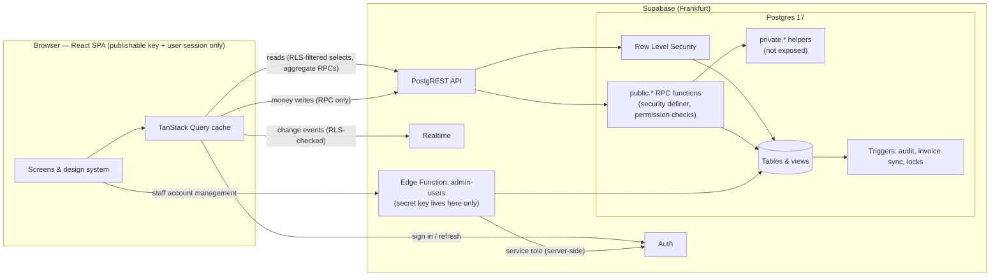
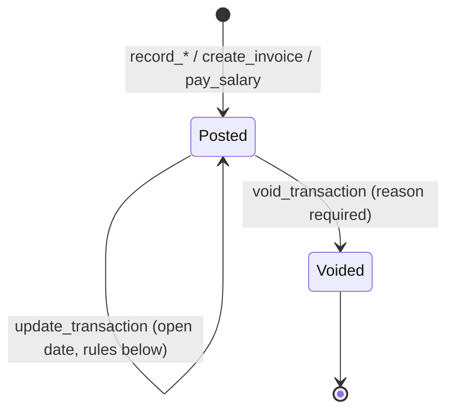

# GYMATICK — Implementation Prompt & System Specification

> **Version** 1.0 · 14 Sep 2026
> **Status** Project set up. Screen prototypes are under review; build starts after design approval.
> **Audience** The engineer or AI coding agent implementing GYMATICK end to end.

---

## Table of contents

0. [Your role and how to use this document](#0-your-role-and-how-to-use-this-document)
1. [Product overview](#1-product-overview)
2. [Priorities and non-negotiable principles](#2-priorities-and-non-negotiable-principles)
3. [Current setup (already done)](#3-current-setup-already-done)
4. [System architecture](#4-system-architecture)
5. [Financial model — the source of truth](#5-financial-model--the-source-of-truth)
6. [Roles and permissions](#6-roles-and-permissions)
7. [Database design](#7-database-design)
8. [Server-side Edge Functions](#8-server-side-edge-functions)
9. [Frontend architecture](#9-frontend-architecture)
10. [Module specifications](#10-module-specifications)
11. [Design system](#11-design-system)
12. [Responsive behavior](#12-responsive-behavior)
13. [Accessibility](#13-accessibility)
14. [Security checklist](#14-security-checklist)
15. [Performance requirements](#15-performance-requirements)
16. [Testing strategy](#16-testing-strategy)
17. [Seed and demo data policy](#17-seed-and-demo-data-policy)
18. [Environments, deployment and operations](#18-environments-deployment-and-operations)
19. [Build plan](#19-build-plan)
20. [End-to-end acceptance scenario](#20-end-to-end-acceptance-scenario)
21. [Definition of done](#21-definition-of-done)
- [Appendix A — Somali / English terminology](#appendix-a--somali--english-terminology)
- [Appendix B — Error code catalog](#appendix-b--error-code-catalog)
- [Appendix C — Audit action catalog](#appendix-c--audit-action-catalog)

---

## 0. Your role and how to use this document

You are the lead engineer building **GYMATICK**, a production-grade financial management and administration platform for a gym. This is not a CRUD dashboard or an accounting template. It is a small, correct accounting system with a premium interface.

Rules for the implementer:

1. **Read the whole document before writing code.** Sections depend on each other — the financial model (§5) drives the schema (§7), which drives the screens (§10).
2. **Decisions in this document are final unless the product owner changes them.** Where the original brief left a choice open, this document makes it and says why. Do not silently substitute a different approach.
3. **When something is genuinely ambiguous, choose financial correctness first, then security, then performance, then polish.** Record the decision in `docs/decisions.md`.
4. **Never ship fake data, placeholder charts, dead buttons or "coming soon" actions presented as working.** Every visible control either works or is disabled with a visible reason.
5. **Verify library APIs against the installed versions** (§3). Several are newer than common training data: Vite 8, Tailwind CSS 4, Zod 4, Recharts 3, react-day-picker 10, lucide-react 1.x, TypeScript 6, Vitest 5.
6. **The database is the authority.** Client-side calculations exist only for instant feedback (live form totals). Stored and reported numbers always come from Postgres.
7. **After every migration batch**, run the Supabase security and performance advisors and fix every finding before moving on.
8. **Work milestone by milestone (§19).** A milestone is done only when its tests pass.

---

## 1. Product overview

### 1.1 What GYMATICK is

A secure web application where the GYMATICK owner and staff record, control, reconcile and analyze every financial activity of the gym: money received, money spent, invoices, salaries, and the daily closing of accounts (**Xisaab Xir**).

The Dashboard must let the owner answer six questions in seconds:

1. How much money came in?
2. How much money went out?
3. How much money should the gym have right now?
4. Have today's accounts been closed — and did they balance?
5. Are there unpaid salary obligations?
6. How is the business performing over time?

Every number must be traceable to the transactions behind it, and every transaction to the person who recorded it and when.

### 1.2 Users

| Role | Who | Typical work |
| --- | --- | --- |
| **Owner / Admin** | Gym owner, co-owners, trusted administrators | Everything: reports, Xisaab Xir, salaries, employees, corrections, settings, users |
| **Staff / Manager** | Front desk, gym manager | Record income and expenses, create invoices, view permitted information. More access only if the Owner grants it |

### 1.3 Modules in scope (v1)

Authentication · First-run onboarding · Dashboard · Income (Lacagta Soo Gasha) · Expenses (Lacagta Baxda) · Transactions ledger · Xisaab Xir (daily closing) and closing history · Salaries (Mushahar) · Employees · Invoices and receipts · Customers · Reports and analytics · Activity log · Settings · Users and roles.

### 1.4 Out of scope for v1 (architecture leaves room)

- Member check-in, attendance, class scheduling, membership plan automation
- Payment gateway or mobile-money API integration (EVC Plus / ZAAD / SAHAL APIs). If added later, secrets and webhooks stay server-side (Edge Functions)
- Multiple currencies inside one business; currency conversion
- Accrual accounting, tax, payroll deductions
- Inventory and stock tracking
- SMS / WhatsApp notifications
- Multiple branches in the UI (the data model already carries `branch_id`; §7)

---

## 2. Priorities and non-negotiable principles

Priority order: **financial correctness → security → performance → visual polish and ease of use (throughout).**

| # | Principle | What it means in practice |
| --- | --- | --- |
| P1 | **One ledger is the source of truth** | Every money movement is one row in `financial_transactions`. Income, Expenses, Dashboard, Reports and Xisaab Xir all read it. No module keeps its own money totals. |
| P2 | **Money is exact** | `numeric(14,2)` in Postgres, integer minor units (cents) in TypeScript. Never floating point for stored or calculated money. |
| P3 | **Nothing financial is deleted** | Mistakes are *voided* with a reason. Voided rows stay visible in history and are excluded from totals. No DELETE privilege exists on financial tables. |
| P4 | **Balances are calculated, never typed** | There is no editable "current balance". Balance = last counted closing + movements since. |
| P5 | **Closed days are locked** | Once Xisaab Xir closes a date, transactions dated inside it cannot be created or financially edited. Corrections are explicit, owner-only, reasoned and visible on the closing. |
| P6 | **Multi-step money operations are atomic** | Invoice + payment, salary payment + expense, transfer legs, closing header + lines: one database function, one transaction, all or nothing. |
| P7 | **The database enforces authorization** | Row Level Security on every table; write functions re-check membership and permissions. React route guards and hidden buttons are UX only. |
| P8 | **Every sensitive action is audited** | Append-only audit log with actor, action, record, time and a human summary. |
| P9 | **Financial writes are idempotent** | Every create call carries a client-generated idempotency key; a retry after a double-click or network drop returns the original record instead of creating a second one. |
| P10 | **Accounting dates are computed on the server in the business timezone** | `business_date` is separate from the `occurred_at` timestamp; browser time is never used to decide which day a transaction belongs to. |
| P11 | **Aggregation happens in Postgres** | The browser never downloads rows to add them up. |
| P12 | **Never trust the client** | Business IDs, roles, amounts, dates and statuses from the client are validated server-side; derived values (expected balance, invoice totals, statuses) are recomputed server-side. |

---

## 3. Current setup (already done)

### 3.1 Repository

Path: `C:\Users\hp\Desktop\all ai agents\gymatick` (git initialized, nothing committed yet).

| Area | Installed | Notes |
| --- | --- | --- |
| Runtime | Node.js 22.19 | React Router 8 needs Node ≥ 22.22 — staying on React Router 7 is intentional |
| Build | Vite 8.3, `@vitejs/plugin-react` 6.1, React Compiler (`babel-plugin-react-compiler` 1.0 via `@rolldown/plugin-babel`) | React Compiler handles memoization; add manual `useMemo`/`memo` only with a measured reason |
| UI | React 19.3, TypeScript 6.0 (`strict`, `noUncheckedIndexedAccess`) | Path alias `@/` → `src/` |
| Styling | Tailwind CSS 4.3 via `@tailwindcss/vite` | Tokens in `src/index.css` (`@theme`) |
| Data | `@supabase/supabase-js` 2.116 | Client in `src/lib/supabase.ts` |
| Server state | `@tanstack/react-query` 5.102 (+ devtools) | |
| Routing | `react-router` 7.18 | |
| Forms | `react-hook-form` 7.88, `zod` 4.6, `@hookform/resolvers` 5.9 | |
| UI primitives | `radix-ui` 1.6 (dialogs, popovers, menus, select, tabs, tooltip) | Accessible behavior; styling is ours |
| Dates | `date-fns` 4.4, `@date-fns/tz` 1.5, `react-day-picker` 10 | |
| Charts / icons / toasts | `recharts` 3.10, `lucide-react` 1.45, `sonner` 2.0 | |
| Utilities | `clsx`, `tailwind-merge`, `class-variance-authority` | |
| Tests | `vitest` 5, `@testing-library/react` 16, `@testing-library/jest-dom`, `@testing-library/user-event`, `jsdom` 29, `@vitest/coverage-v8` | `src/lib/supabase-keys.test.ts` passes |
| Lint | Oxlint 1.8 | |
| Supabase CLI | `supabase` 2.117 (dev dependency) | `supabase/config.toml` created; local sign-up disabled, password min length 10 |

Scripts: `dev`, `build`, `preview`, `lint`, `typecheck`, `test`, `test:watch`, `test:coverage`, `db:types`.

Security already in place:

- `.env.local` holds only browser-safe values (`VITE_SUPABASE_URL`, `VITE_SUPABASE_PUBLISHABLE_KEY`); `.env*` is git-ignored except `.env.example`.
- `src/lib/env.ts` validates configuration at startup and **refuses to run if a secret or service-role key is placed in a `VITE_*` variable**.
- `index.html` has `noindex, nofollow` (admin application).

### 3.2 Supabase project

| Property | Value |
| --- | --- |
| Name / ref | `gymatick` / `phzweuqzlyqhrjsxecob` |
| Region | `eu-central-1` (Frankfurt) |
| API URL | `https://phzweuqzlyqhrjsxecob.supabase.co` |
| Plan | Free (organization "kumalamohamed3@gmail.com's Org") |
| Postgres | 17 |
| Keys in app | Publishable key (`sb_publishable_…`) only |

This project is the **development** project. Production gets a separate, clean project on the Pro plan (§18).

### 3.3 Required before the build starts

1. In the hosted project: **Authentication → Sign In / Providers → disable "Allow new users to sign up"**. Set Site URL and redirect URLs (`http://localhost:5173/**` for development). Minimum password length 10.
2. Put the real GYMATICK logo (SVG preferred, otherwise PNG ≥ 512 px) in `src/assets/brand/`. Until then, the placeholder wordmark is used.
3. Decide whether invitation emails are needed. They require custom SMTP (Supabase's built-in email only reaches organization team members). Without SMTP, staff accounts are created with a temporary password (§8).

---

## 4. System architecture

### 4.1 Overview



### 4.2 The three paths

| Path | Used for | How it is protected |
| --- | --- | --- |
| **Read** | Lists, details, lookups | PostgREST selects on tables/views with `security_invoker = true`, filtered by RLS. Aggregates (dashboard, reports, closing preview) are `stable` RPC functions that check permissions and return only what the caller may see. |
| **Write** | Every change to money, invoices, salaries, closings, employees, settings, members | `public.*` RPC functions: `security definer`, `set search_path = ''`, `EXECUTE` granted to `authenticated` only. Each function verifies active membership and the required permission, validates input, performs the whole operation in one transaction and writes the audit entry. Direct `INSERT/UPDATE/DELETE` privileges on these tables are **revoked** from `anon` and `authenticated`. |
| **Server-only** | Creating/inviting staff logins, banning deactivated users, resetting passwords | Edge Function `admin-users` holds the service-role key in Supabase secrets, verifies the caller's JWT and Owner permission, then calls the Auth Admin API. |

The only direct client write is uploading a logo to the `brand-assets` storage bucket, allowed by storage policy for users with `settings.manage`. Everything else — including a user editing their own profile — goes through RPC functions.

### 4.3 Why RPC functions for writes

- **Atomicity** — an invoice cannot exist without its payment row, a salary payment cannot exist without its expense (P6).
- **Server-side validation of derived values** — expected closing balances, invoice totals, salary remaining amounts and business dates are computed inside the function, never accepted from the client (P12).
- **Locking** — closing and salary payments need row/advisory locks that PostgREST table writes cannot express.
- **One audit path** — each function writes a semantic audit event (`income.voided`, not "row updated").

The Supabase linter reports `security definer` functions executable by `authenticated`. That is expected for these intentional entry points. Every such function must start with a permission assertion; the RLS test suite (§16.2) proves it.

### 4.4 Database schemas

| Schema | Contents | Exposed via API |
| --- | --- | --- |
| `public` | Tables, `security_invoker` views, RPC entry points | Yes |
| `private` | RLS helper functions, sequence/lock/audit helpers, bootstrap function | **No** — `USAGE` granted to `authenticated` only so RLS policies can call helpers; nothing in it is callable over HTTP |

### 4.5 Frontend layers

```
screens (routes)  →  feature hooks (useIncomeList, useRecordIncome…)
                  →  api layer (typed Supabase calls, error mapping)
                  →  supabase client
shared: design system components · lib/money · lib/dates · lib/permissions · i18n
```

Screens never call Supabase directly. Feature hooks own query keys and cache invalidation (§9.4).

---

## 5. Financial model — the source of truth

This section is the heart of the system. Schema, functions, screens and tests must implement it exactly.

### 5.1 Glossary

| Term | Meaning |
| --- | --- |
| **Business** | The gym (GYMATICK). The tenant boundary: every record belongs to exactly one business. |
| **Branch** | A physical location of a business. v1 has one default branch; the UI hides branch selection while only one exists. |
| **Member** | A user's membership in a business, with a role and permissions. |
| **Payment method** | Where money moves and is held: Cash, EVC Plus, ZAAD, SAHAL, Bank. Each method is also a balance "account" for Xisaab Xir. |
| **Transaction** | One row in the ledger (`financial_transactions`): a single money movement. |
| **Business date** | The accounting day a transaction belongs to, in the business timezone. |
| **Occurred at** | The exact moment money moved (`timestamptz`). |
| **Posted / Voided** | A posted transaction counts in totals. A voided one is kept for history and excluded everywhere. |
| **Xisaab Xir (closing)** | Reconciling a business date: expected balance vs counted money, then locking the date. |
| **Checkpoint** | The counted (actual) balances saved by the latest closing. All current balances start from it. |
| **Salary period** | A calendar month (stored as the first day of the month) that a salary payment belongs to. |
| **Obligation** | What an employee is owed for a period. Not a ledger entry (the system is cash-basis). |

### 5.2 Transaction kinds

Amounts are always positive; the **kind** decides the direction.

| Kind | Direction | Counts in | Category | Created by | Notes |
| --- | --- | --- | --- | --- | --- |
| `income` | in (+) | Income | income category, required | `record_income`, `create_invoice`, `record_invoice_payment` | May link a customer and an invoice |
| `refund` | out (−) | Reduces Income (shown as Refunds) | same income category as the original | `record_refund` | Must reference the original income; total refunds ≤ original amount |
| `expense` | out (−) | Expenses | expense category, required | `record_expense`, `pay_salary` | `is_salary = true` only when created by `pay_salary` |
| `transfer_out` / `transfer_in` | out / in | Nothing (moves money between methods) | none | `record_transfer` | Always a pair sharing `transfer_group_id`, same amount and date |
| `owner_deposit` | in (+) | Nothing (capital) | none | `record_owner_movement` | Owner puts money into the business |
| `owner_withdrawal` | out (−) | Nothing (drawing) | none | `record_owner_movement` | Owner takes money out. **Not an expense.** |

> **Why transfers and owner movements exist.** Xisaab Xir reconciles each payment method separately. Moving $100 from EVC Plus to the cash drawer, or the owner taking $200 home, is neither income nor expense. Without these kinds every such day would show a false discrepancy — or someone would record the withdrawal as an expense and understate profit.

### 5.3 Metric dictionary — one definition per number

Every screen, export and test uses these definitions. All metrics count **posted** transactions only and filter by **`business_date`**.

| Metric | Definition |
| --- | --- |
| **Gross income** | Σ `income` |
| **Refunds** | Σ `refund` |
| **Income** (net) | Gross income − Refunds. *Wherever the UI says "Income", it means this.* |
| **Expenses** | Σ `expense` (includes salary expenses) |
| **Salaries paid** | Σ `expense` where `is_salary` (a subset of Expenses, never added on top) |
| **Net result** | Income − Expenses |
| **Owner deposits / withdrawals** | Σ `owner_deposit` / Σ `owner_withdrawal` — shown separately, excluded from Net result |
| **Transfers** | Σ `transfer_out` — informational; nets to zero across methods |
| **Money in** (per method) | Σ `income` + `owner_deposit` + `transfer_in` |
| **Money out** (per method) | Σ `expense` + `refund` + `owner_withdrawal` + `transfer_out` |
| **Current balance** (per method) | Checkpoint actual (latest active closing) + Σ signed amounts with `business_date` after the checkpoint date |
| **Current balance** (total) | Σ current balance over all payment methods |
| **Transaction count** | Posted rows, counting a transfer pair once (exclude `transfer_in`) |
| **Average daily income** | Income ÷ calendar days in range (a range ending in the future counts days only up to today) |
| **Pending salaries** (period) | Σ max(obligation − paid, 0) over eligible employees |
| **Outstanding invoices** | Σ (`total` − `amount_paid`) for invoices in `pending` or `partially_paid` |
| **Closing differences** | Σ `difference_total` of active closings whose `business_date` is in range |

Consistency rule: for the same date range, Dashboard, Income, Expenses, Transactions, Reports and closing previews must return identical values for the metrics they share. A test asserts this (§16.2).

### 5.4 Money, currency and rounding

- **Storage:** `numeric(14,2)` for amounts, `numeric(10,2)` for quantities. `CHECK (amount > 0)` on ledger rows. Maximum 999,999,999,999.99.
- **Precision:** inputs with more decimals than the currency allows are **rejected, not rounded**. Server check: `amount = round(amount, currency_decimals)`.
- **Rounding** (invoice line totals only): `round(quantity × unit_price, 2)` — Postgres numeric rounding, half away from zero. Totals are sums of already-rounded lines.
- **Currency:** one per business (`currency_code` ISO 4217, default `USD`; `currency_symbol`; `currency_decimals` 2 or 0). **Currency cannot be changed once any transaction exists** (`CURRENCY_LOCKED`) — existing amounts would be reinterpreted.
- **TypeScript:** money is an integer number of minor units (`type Minor = number`, always `Number.isSafeInteger`).
  - From user input: string → validate pattern → minor units. Accept `1250`, `1250.5`, `1,250.50`. Reject negatives, letters, more decimals than allowed, more than 12 integer digits.
  - From the API: numeric values arrive as JSON numbers or strings; convert with string-based parsing (`toMinor("1250.50") → 125050`), never `value * 100` on a float.
  - To RPC parameters: send decimal **strings** built from minor units (`"1250.50"`).
- **Display:** `Intl.NumberFormat` with `style: currency` and `currencyDisplay: narrowSymbol`. Money in tables uses tabular figures and is right-aligned. Income shows `+$50.00`, expenses `−$35.00` — the sign is always present, so color never carries meaning alone.
- **Large amounts:** amounts ≥ `large_amount_threshold` (setting, default 1,000) require an explicit confirmation step in the form.

### 5.5 Business date and timezone

Settings: `timezone` (IANA, default `Africa/Mogadishu`, UTC+3, no DST), `day_cutoff` (time, default `00:00`), `week_starts_on` (0–6, default 6 = Saturday).

- `occurred_at` is the moment money moved. Default `now()`.
- `business_date` is computed **in Postgres**:
  ```sql
  -- private.business_date_for(p_business_id uuid, p_ts timestamptz) returns date
  select ((p_ts at time zone s.timezone) - s.day_cutoff)::date
  from public.business_settings s
  where s.business_id = p_business_id;
  ```
  With cutoff `03:00`, a payment at 01:30 on 15 Sep belongs to 14 Sep — for gyms open past midnight.
- `private.current_business_date(business_id)` = `business_date_for(business_id, now())`. The client receives "today" from the server (session context and every dashboard response) and never derives it from the browser clock.
- **Allowed dates for new transactions:**
  - `min_allowed` = last closed date + 1 (or the go-live date if nothing is closed yet)
  - `max_allowed` = greatest(current business date, last closed date + 1)
  - Dates before the current business date require the `transactions.backdate` permission.
  - If today is already closed, the only allowed date is tomorrow, and the form says so: "Today is closed. This will be recorded on 15 Sep."
- **Backdated entries:** when `business_date` differs from `business_date_for(created_at)`, `occurred_at` is set to 12:00 local on that date and the row is flagged `is_backdated`. `created_at` always stays the true recording time.
- **Filters and reports** use `business_date` (a plain `date`), so range queries involve no timezone conversion. Presets (Today, Yesterday, This week, This month, Last month) are computed from the server's current business date and `week_starts_on`.
- **Display:** timestamps render in the business timezone (`TZDate` from `@date-fns/tz`), labeled with the zone where ambiguity matters (closing times, audit log).
- Changing timezone or cutoff affects only future records and requires a confirmation dialog that says so.

### 5.6 Transaction lifecycle



**Create** — only through RPC functions. Server sets `business_id` checks, `business_date`, `reference_no`, `created_by`, `created_at`.

**Edit** (`update_transaction`):

| Field group | Fields | Allowed when |
| --- | --- | --- |
| Descriptive | description, notes, customer, vendor | Always (even on closed dates) with `income.edit` / `expenses.edit`, or by the creator within the edit window. Audited. |
| Financial | amount, business date, category, payment method | Date is **open** **and** caller has `income.edit` / `expenses.edit`, or is the creator within `staff_edit_window_minutes` (setting, default 10). **Reason required.** New date must also be allowed (§5.5). |
| Never | kind, business, reference number, idempotency key, creator, links | Immutable (trigger-enforced) |

Linked rows (invoice payments, salary expenses, transfer legs, refunds) cannot have financial fields edited at all — void and redo through their module, so links stay consistent.

**Void** (`void_transaction`):

- Requires a reason (≥ 5 characters) and `transactions.void`, or the creator within the edit window on an open date.
- On a **closed** date: requires `closings.correct` (owner-only). The closing snapshot is not changed; the correction appears on that closing (§5.7.6).
- Voiding one transfer leg voids both. Voiding a salary expense voids the salary payment (its status is read from the transaction). Voiding an invoice payment re-derives the invoice status (trigger).
- A refunded income cannot be voided while posted refunds reference it.

**Refund** (`record_refund`): money returned to a customer *today* for an earlier income. Use it for real refunds. Use **void** only for entries that should never have existed (duplicates, typing mistakes). The UI explains this difference in both dialogs.

### 5.7 Xisaab Xir — daily closing

#### 5.7.1 Model

Balances are anchored on **checkpoints** — the money actually counted at each closing.

```
Current balance(method) = checkpoint actual(method)
                        + Σ signed amount of posted transactions
                          with business_date > checkpoint date
```

- The **first checkpoint** is created by onboarding: an `opening` closing dated the day before go-live, whose lines hold the opening balance per payment method (zeros are allowed).
- Every closing is a checkpoint. Closing date D covers the **period** from (previous checkpoint date + 1) to D. Normally one day; if days were skipped, the period spans them and the UI says "Covers 12–14 Sep (3 days)".
- Because balances restart from counted money, a discrepancy never keeps distorting later days, and there is only one definition of balance — no second balance system to drift.

#### 5.7.2 Calculation (per payment method, then totals)

```
opening   = previous checkpoint actual for this method (0 for methods added later)
money in  = income + owner_deposit + transfer_in     (posted, business_date in period)
money out = expense + refund + owner_withdrawal + transfer_out
expected  = opening + money in − money out
actual    = counted by the user
difference = actual − expected
```

Totals are the sums of the method lines. The user-facing summary keeps the familiar formula:

> **Opening balance + Money received − Money used = Expected closing**

**Worked example** (the reference case used in tests):

| Method | Opening | In | Out | Expected | Actual | Difference |
| --- | ---: | ---: | ---: | ---: | ---: | ---: |
| Cash | 300.00 | 250.00 | 110.00 | 440.00 | 425.00 | **−15.00** |
| EVC Plus | 200.00 | 0.00 | 25.00 | 175.00 | 175.00 | 0.00 |
| ZAAD / SAHAL / Bank | 0.00 | 0.00 | 0.00 | 0.00 | 0.00 | 0.00 |
| **Total** | **500.00** | **250.00** | **135.00** | **615.00** | **600.00** | **−15.00** |

Result: **Discrepancy −$15.00 (Cash)**; notes are required.

#### 5.7.3 Preconditions to close date D

- Caller has `closings.perform`.
- D ≤ current business date (no closing the future) and D > last checkpoint date.
- Onboarding (opening checkpoint) is complete.
- Every method line shown has an actual amount. Methods with zero opening and no activity are pre-filled with 0 and collapsed.
- If any line difference ≠ 0, `notes` has ≥ 5 characters.

#### 5.7.4 Preview and perform (race-safe)

1. `get_closing_preview(business, D)` returns lines, totals, the period, transaction count and a `preview_token` — a hash of the period's posted-transaction count, sum and latest `updated_at`.
2. The user counts money and enters actuals.
3. `perform_closing(business, D, actuals, notes, preview_token, idempotency_key)`:
   - takes an exclusive per-business advisory lock (transaction writes take the shared lock, so a closing waits for in-flight writes and briefly blocks new ones);
   - **recomputes** everything server-side; if the token no longer matches → `CLOSING_STALE`, and the UI reloads the preview ("New activity was recorded while you were counting");
   - rejects a second active closing for D → `ALREADY_CLOSED` (unless the idempotency key matches, which returns the existing closing);
   - inserts the header and lines, writes `closing.completed` to the audit log.

#### 5.7.5 Locking and reopening

- After closing, no transaction can be created with `business_date` in the period, and financial fields of existing ones cannot change (trigger `private.assert_date_open`).
- **Reopen** (`reopen_closing`): owner-only (`closings.reopen`), **only the most recent closing**, reason required. Status becomes `reopened` (kept for history); the period is editable again; a new closing is required. Audited.

#### 5.7.6 Corrections after closing

- Only voids are possible on closed dates, only by `closings.correct`, with a reason.
- The closing keeps its original snapshot (what was expected and counted at the time).
- The closing detail screen shows a **"Changed after closing"** section: each correction (who, when, why) plus the recalculated expected and difference.
- Reports always use the corrected ledger. The closing history shows a "Corrected" badge on affected closings.

### 5.8 Invoices and the ledger

An **invoice is a bill, not money**. Money is only ever a ledger row.

- **Numbering:** `{prefix}-{YYYY}-{00001}` (prefix setting, default `INV`), sequential per business per year, generated in the database. Unique per business.
- **Totals:** line total = `round(quantity × unit_price, 2)`; subtotal = Σ line totals; `discount_amount` ≥ 0 and ≤ subtotal (fixed amount in v1); total = subtotal − discount.
- **Payments** are ledger rows of kind `income` with `invoice_id` set (refunds with `invoice_id` reduce the paid amount).
- **`amount_paid` and `status` are stored** for fast list filtering and kept in sync by exactly one mechanism: a trigger on `financial_transactions` recomputes them whenever a row with `invoice_id` is inserted or voided. Clients can never write them.
- **Status:** `pending` (nothing paid) → `partially_paid` → `paid` (amount paid = total). `cancelled` is terminal. "Overdue" is not stored: it is displayed when `due_date` < today and balance > 0.
- **Overpayment is impossible:** amount paid ≤ total (`OVERPAYMENT`).
- **Three ways to get paid, each counts the money exactly once:**
  1. *Create and collect now* — `create_invoice` with a payment object creates the invoice, items and income row in one transaction.
  2. *Collect later* — `record_invoice_payment` adds an income row to an unpaid invoice (partial payments allowed).
  3. *Invoice for money already recorded* — `create_invoice` with `link_transaction_id`, or `link_income_to_invoice`, attaches an existing posted, unlinked income row. **No new income is created.** The row's amount must not exceed the invoice balance.
- **Category:** an invoice has one income category, used for its payments. When linking an existing income, the invoice takes that income's category.
- **Editing:** items, dates, customer, category and discount can change only while no payment exists. Notes can always change. Audited.
- **Cancelling:** allowed when there are no posted payments. With payments, an owner can choose "Void payments and cancel" (requires `transactions.void`, and `closings.correct` if any payment date is closed).
- **Bill-to snapshot:** `bill_to_name` and `bill_to_phone` are copied onto the invoice when it is created, so a printed invoice never changes when a customer is renamed. Empty = "Walk-in customer".

### 5.9 Salaries and the ledger

- **Employees** have a salary rate history (`employee_salary_rates`): each rate has an `effective_month` (first day of a month). Changing a salary means adding a rate from a chosen month; old periods keep their old rate.
- **Eligible for period M:** `start_date` ≤ last day of M, and `end_date` is empty or ≥ first day of M.
- **Obligation(employee, M)** = the rate with the latest `effective_month` ≤ M. No proration in v1 — the owner can pay a different amount.
- **Paid(employee, M)** = Σ posted salary expenses linked to that employee and period.
- **Status per employee and period:** `paid` (paid = obligation), `partial` (0 < paid < obligation), `unpaid` (paid = 0, obligation > 0), `overpaid` (paid > obligation, only possible through an adjustment).
- **Tracking starts at go-live:** periods before `salary_tracking_start_month` never appear as arrears.
- **Payment types:** `salary` and `advance` count toward the obligation and cannot exceed the remaining amount. `adjustment` (bonus or correction) may exceed it and requires `salaries.adjust` plus a reason.
- **`pay_salary`** locks the employee row (`SELECT … FOR UPDATE`) so two simultaneous payments cannot both pass the remaining-amount check. In one transaction it inserts the ledger expense (`is_salary = true`, system category "Salary", description "Salary · {name} · {Month YYYY}"), then the `salary_payments` row referencing it (`transaction_id NOT NULL UNIQUE`).
- **Exactly once, enforced by the database:**
  - a salary payment cannot exist without its expense (NOT NULL foreign key);
  - an expense cannot back two salary payments (UNIQUE);
  - an `is_salary` expense cannot exist without a salary payment (deferred constraint trigger checked at commit);
  - manual expenses cannot use the system Salary category (`record_expense` rejects it).
- Salary payment amount, date, method and status are **read from the linked transaction**, not stored twice.
- Pending salaries are obligations shown for planning. They are not ledger entries (cash-basis accounting).

### 5.10 Idempotency and concurrency

- Every create-type RPC takes `p_idempotency_key uuid`. The client generates it when a form or dialog opens and keeps it until the operation succeeds or the form is reset.
- Tables carrying create operations have `idempotency_key uuid NOT NULL` with `UNIQUE (business_id, idempotency_key)`.
- On conflict the function returns the **existing** record (HTTP success), so retrying after a lost response is safe. If the same key arrives with different parameters, the function raises `IDEMPOTENCY_MISMATCH`.
- Submit buttons disable while a request is in flight; forms also ignore repeated Enter presses.
- Locks: per-business advisory lock (shared for transaction writes, exclusive for closings); employee row lock for salary payments; `document_sequences` row lock for numbering.

### 5.11 Error contract

RPC functions raise `P0001` with `message = '<CODE>'`, a human-readable `detail`, and an optional JSON `hint` carrying structured data (for example the next open date). The client maps codes to translated messages and, for validation codes, to the specific form field. The full list is in [Appendix B](#appendix-b--error-code-catalog).

---

## 6. Roles and permissions

### 6.1 Roles

| Role key | Display name | Access |
| --- | --- | --- |
| `owner` | Owner / Admin | Every permission implicitly, including owner-only ones. A business can have several owners; at least one active owner must always remain. |
| `staff` | Staff / Manager | Only the permissions explicitly granted in `member_permissions`. New staff get the **Front desk** defaults. |

Permissions are checked **per request from the database**, never from JWT claims, so a role change or deactivation takes effect on the very next request.

### 6.2 Permission catalog

| Key | Module | Allows | Front desk default | Manager preset | Owner only |
| --- | --- | --- | :---: | :---: | :---: |
| `dashboard.financials` | Dashboard | See current balance, pending salaries, closing results and charts | | ✓ | |
| `income.view` | Income | View income and refunds | ✓ | ✓ | |
| `income.create` | Income | Record income | ✓ | ✓ | |
| `income.edit` | Income | Edit any income (rules in §5.6) | | ✓ | |
| `expenses.view` | Expenses | View expenses (salary rows also need `salaries.view`) | ✓ | ✓ | |
| `expenses.create` | Expenses | Record expenses | ✓ | ✓ | |
| `expenses.edit` | Expenses | Edit any expense | | ✓ | |
| `transactions.view_all` | Transactions | Open the full ledger, including transfers and owner movements | | ✓ | |
| `transactions.void` | Transactions | Void transactions on open dates | | ✓ | |
| `transactions.backdate` | Transactions | Record transactions on earlier open dates | | ✓ | |
| `transactions.refund` | Transactions | Record refunds | | ✓ | |
| `money.transfer` | Transactions | Record transfers between payment methods | | ✓ | |
| `money.owner_movements` | Transactions | Record owner deposits and withdrawals | | | |
| `invoices.view` | Invoices | View invoices | ✓ | ✓ | |
| `invoices.create` | Invoices | Create invoices (with or without payment) | ✓ | ✓ | |
| `invoices.record_payment` | Invoices | Record payments and link existing income | ✓ | ✓ | |
| `invoices.edit` | Invoices | Edit unpaid invoices | | ✓ | |
| `invoices.cancel` | Invoices | Cancel invoices | | ✓ | |
| `customers.view` | Customers | View customers | ✓ | ✓ | |
| `customers.manage` | Customers | Add and edit customers | ✓ | ✓ | |
| `closings.view` | Xisaab Xir | View closing previews, history and details | | ✓ | |
| `closings.perform` | Xisaab Xir | Complete Xisaab Xir | | ✓ | |
| `closings.reopen` | Xisaab Xir | Reopen the latest closing | | | ✓ |
| `closings.correct` | Xisaab Xir | Void transactions on closed dates | | | ✓ |
| `employees.view` | Employees | View employees (salary amounts also need `salaries.view`) | | ✓ | |
| `employees.manage` | Employees | Add, edit, deactivate employees | | | |
| `salaries.view` | Salaries | View salaries, obligations and salary expenses | | | |
| `salaries.pay` | Salaries | Pay salaries and advances | | | |
| `salaries.adjust` | Salaries | Record salary adjustments beyond the obligation | | | |
| `reports.view` | Reports | Open reports and analytics | | ✓ | |
| `reports.export` | Reports | Export CSV and print reports | | | |
| `audit.view` | Activity log | View the activity log | | | |
| `settings.manage` | Settings | Business profile, preferences, categories, payment methods | | | |
| `users.manage` | Users | Create, edit, deactivate users; change roles and permissions | | | ✓ |

Presets are shortcuts in the user editor; what is stored is the individual grants.

### 6.3 Enforcement layers

| Layer | Mechanism | Purpose |
| --- | --- | --- |
| 1. UI | `usePermission('income.create')` hides or disables controls, with a tooltip saying who can do it | Clarity |
| 2. Routes | `<RequirePermission>` guard renders the 403 screen | Clarity |
| 3. Reads | RLS policies on every table and `security_invoker` views | **Security** |
| 4. Writes | Every RPC begins with `private.assert_permission(business_id, key)` | **Security** |
| 5. Data | Composite foreign keys include `business_id`, so a row can never reference another business's category, method, customer, employee or invoice — even with a guessed UUID | **Security** |

Layers 1–2 are never relied on for protection. The test suite calls the API directly as a restricted user to prove layers 3–5 (§16.2).

### 6.4 Privilege-escalation guards

- Members cannot change their own role, permissions or status.
- `users.manage` is owner-only; owner-only permissions cannot be granted to staff (trigger on `member_permissions`).
- The last active owner cannot be demoted or deactivated (`LAST_OWNER`).
- `business_members` and `member_permissions` have **no client write privileges**; changes go through `update_member` (RPC) or the `admin-users` Edge Function.
- Deactivating a member sets membership status to `inactive` (every RLS helper returns false immediately) **and** bans the auth user via the Edge Function so their session can no longer refresh.

---

## 7. Database design

### 7.1 Conventions

- **Primary keys:** `id uuid PRIMARY KEY DEFAULT gen_random_uuid()`.
- **Tenancy:** every business-owned table has `business_id uuid NOT NULL` and `UNIQUE (business_id, id)`, so child tables can use **composite foreign keys** `(business_id, x_id) → parent(business_id, id)`. Cross-business references are impossible by construction.
- **Timestamps:** `created_at timestamptz NOT NULL DEFAULT now()`, `updated_at timestamptz NOT NULL DEFAULT now()` maintained by trigger `private.set_updated_at()`. Actor columns `created_by` / `updated_by uuid REFERENCES profiles(id)`.
- **No deletes:** financial and historical tables have no DELETE privilege for `anon`/`authenticated` and no DELETE policy. Master data uses `status` (`active`/`inactive`).
- **Enums:** Postgres enum types (they generate union types in TypeScript). Add values with `ALTER TYPE … ADD VALUE`; never remove.
- **Text limits:** enforce with `CHECK (char_length(x) BETWEEN …)`; trim with `btrim` in RPCs.
- **Money:** `numeric(14,2)`; quantities `numeric(10,2)`.
- **Naming:** snake_case, plural table names, `fk_`, `uq_`, `ck_`, `idx_` prefixes for constraints and indexes.
- **Functions:** `SET search_path = ''`, fully qualified names (`public.financial_transactions`), `SECURITY DEFINER` only where required, `REVOKE ALL … FROM public, anon` then `GRANT EXECUTE … TO authenticated`.
- **Extensions:** `pg_trgm` (search). `gen_random_uuid()` is built in.

### 7.2 Enum types

| Type | Values |
| --- | --- |
| `member_role` | `owner`, `staff` |
| `record_status` | `active`, `inactive` |
| `category_kind` | `income`, `expense` |
| `payment_method_type` | `cash`, `mobile_money`, `bank`, `other` |
| `transaction_kind` | `income`, `refund`, `expense`, `transfer_in`, `transfer_out`, `owner_deposit`, `owner_withdrawal` |
| `transaction_status` | `posted`, `voided` |
| `invoice_status` | `pending`, `partially_paid`, `paid`, `cancelled` |
| `closing_kind` | `opening`, `daily` |
| `closing_status` | `closed`, `reopened` |
| `salary_payment_type` | `salary`, `advance`, `adjustment` |

### 7.3 Tables

#### `businesses`

| Column | Type | Constraints / notes |
| --- | --- | --- |
| id | uuid | PK |
| name | text | NOT NULL, 1–120 chars |
| legal_name | text | NULL |
| phone, email | text | NULL |
| address, city | text | NULL |
| country | text | NOT NULL DEFAULT `'Somalia'` |
| logo_path | text | NULL — path in the `brand-assets` bucket |
| go_live_date | date | NULL until onboarding sets opening balances |
| onboarding_completed_at | timestamptz | NULL |
| is_demo | boolean | NOT NULL DEFAULT false — development/demo businesses show a banner |
| created_at, updated_at | timestamptz | |

#### `business_settings` (1:1 with businesses)

| Column | Type | Constraints / notes |
| --- | --- | --- |
| business_id | uuid | PK, FK → businesses |
| currency_code | char(3) | NOT NULL DEFAULT `'USD'`, `^[A-Z]{3}$` |
| currency_symbol | text | NOT NULL DEFAULT `'$'` |
| currency_decimals | smallint | NOT NULL DEFAULT 2, IN (0, 2) |
| locale | text | NOT NULL DEFAULT `'en-US'` (number formatting) |
| timezone | text | NOT NULL DEFAULT `'Africa/Mogadishu'`; validated against `pg_timezone_names` by trigger |
| day_cutoff | time | NOT NULL DEFAULT `'00:00'`, ≤ `'06:00'` |
| week_starts_on | smallint | NOT NULL DEFAULT 6, 0–6 |
| invoice_prefix | text | NOT NULL DEFAULT `'INV'`, `^[A-Z0-9]{2,8}$` |
| invoice_footer | text | NULL, ≤ 500 |
| invoice_default_due_days | smallint | NULL, 0–365 |
| large_amount_threshold | numeric(14,2) | NOT NULL DEFAULT 1000, > 0 |
| staff_edit_window_minutes | smallint | NOT NULL DEFAULT 10, 0–120 |
| idle_timeout_minutes | smallint | NOT NULL DEFAULT 30, 5–480 |
| salary_tracking_start_month | date | NULL; first day of month |
| updated_by, updated_at | | |

#### `branches`

| Column | Type | Constraints / notes |
| --- | --- | --- |
| id, business_id | uuid | PK; FK; `UNIQUE (business_id, id)` |
| name | text | NOT NULL; `UNIQUE (business_id, lower(name))` |
| is_default | boolean | NOT NULL DEFAULT false; partial unique index: one default per business |
| status | record_status | NOT NULL DEFAULT `active` |
| address, phone | text | NULL |
| created_at, updated_at | timestamptz | |

#### `profiles` (1:1 with `auth.users`)

| Column | Type | Constraints / notes |
| --- | --- | --- |
| id | uuid | PK, FK → `auth.users(id)` **ON DELETE RESTRICT** (users are deactivated, never deleted) |
| full_name | text | NOT NULL, 1–120 |
| phone | text | NULL |
| avatar_path | text | NULL |
| preferred_language | text | NOT NULL DEFAULT `'en'`, IN (`en`, `so`) |
| theme_preference | text | NOT NULL DEFAULT `'system'`, IN (`system`, `light`, `dark`) |
| must_change_password | boolean | NOT NULL DEFAULT false |
| created_at, updated_at | timestamptz | |

Created by trigger on `auth.users` insert (`full_name` from `raw_user_meta_data`). A trigger on `auth.users` password change clears `must_change_password`.

#### `business_members`

| Column | Type | Constraints / notes |
| --- | --- | --- |
| id, business_id | uuid | PK; FK; `UNIQUE (business_id, id)` |
| user_id | uuid | FK → profiles; `UNIQUE (business_id, user_id)` |
| role | member_role | NOT NULL |
| status | record_status | NOT NULL DEFAULT `active` |
| title | text | NULL (e.g. "Front desk") |
| invited_by | uuid | NULL, FK → profiles |
| deactivated_at, deactivated_by | | NULL |
| last_sign_in_at | timestamptz | NULL (set by `record_sign_in`) |
| created_at, updated_at | timestamptz | |

#### `permissions` (global catalog, seeded by migration)

| Column | Type | Constraints / notes |
| --- | --- | --- |
| key | text | PK (e.g. `income.create`) |
| module | text | NOT NULL |
| label, description | text | NOT NULL (English; UI translates by key) |
| owner_only | boolean | NOT NULL DEFAULT false |
| front_desk_default | boolean | NOT NULL DEFAULT false |
| manager_preset | boolean | NOT NULL DEFAULT false |
| sort_order | smallint | NOT NULL |

#### `member_permissions`

| Column | Type | Constraints / notes |
| --- | --- | --- |
| member_id | uuid | FK → business_members ON DELETE CASCADE |
| permission_key | text | FK → permissions |
| granted_by | uuid | FK → profiles |
| granted_at | timestamptz | NOT NULL DEFAULT now() |
| | | PK (member_id, permission_key); trigger rejects `owner_only` keys |

#### `categories`

| Column | Type | Constraints / notes |
| --- | --- | --- |
| id, business_id | uuid | PK; FK; `UNIQUE (business_id, id, kind)` for the ledger's composite FK |
| kind | category_kind | NOT NULL |
| name | text | NOT NULL, 1–60; `UNIQUE (business_id, kind, lower(name))` |
| description | text | NULL, ≤ 200 |
| color | text | NOT NULL, one of the category palette keys (§11.9) |
| icon | text | NULL, lucide icon name from an allow-list |
| is_system | boolean | NOT NULL DEFAULT false |
| system_code | text | NULL (`salary`); `UNIQUE (business_id, system_code)` |
| status | record_status | NOT NULL DEFAULT `active` |
| sort_order | smallint | NOT NULL DEFAULT 0 |
| created_by, created_at, updated_at | | |

Seeded per business — income: Membership, Registration, Personal Training, Gym Services, Products, Other Income. Expense: Electricity, Water, Internet, Cleaning, Equipment, Maintenance, Rent, **Salary (system)**, Transportation, Supplies, Marketing, Other. System categories cannot be renamed, deactivated or used by manual entries.

#### `payment_methods`

| Column | Type | Constraints / notes |
| --- | --- | --- |
| id, business_id | uuid | PK; FK; `UNIQUE (business_id, id)` |
| name | text | NOT NULL, 1–40; `UNIQUE (business_id, lower(name))` |
| type | payment_method_type | NOT NULL |
| account_label | text | NULL, ≤ 60 — non-secret reference such as "Merchant 612…" |
| include_in_closing | boolean | NOT NULL DEFAULT true |
| status | record_status | NOT NULL DEFAULT `active` |
| sort_order | smallint | NOT NULL DEFAULT 0 |
| created_by, created_at, updated_at | | |

Seeded: Cash (`cash`), EVC Plus, ZAAD, SAHAL (`mobile_money`), Bank (`bank`). Deactivation is rejected while the method's current balance ≠ 0 (`METHOD_HAS_BALANCE`).

#### `customers`

| Column | Type | Constraints / notes |
| --- | --- | --- |
| id, business_id | uuid | PK; FK; `UNIQUE (business_id, id)` |
| full_name | text | NOT NULL, 1–120 |
| phone | text | NULL, ≤ 30 |
| email | text | NULL |
| member_code | text | NULL; `UNIQUE (business_id, member_code)` |
| notes | text | NULL, ≤ 1000 |
| status | record_status | NOT NULL DEFAULT `active` |
| created_by, created_at, updated_at | | |

#### `employees`

| Column | Type | Constraints / notes |
| --- | --- | --- |
| id, business_id | uuid | PK; FK; `UNIQUE (business_id, id)` |
| branch_id | uuid | NOT NULL; composite FK → branches |
| full_name | text | NOT NULL, 1–120 |
| phone | text | NULL |
| position | text | NOT NULL, 1–60 |
| start_date | date | NOT NULL |
| end_date | date | NULL; `CHECK (end_date >= start_date)` |
| status | record_status | NOT NULL DEFAULT `active`; `CHECK (status = 'active' OR end_date IS NOT NULL)` |
| profile_id | uuid | NULL, FK → profiles (if the employee is also a system user) |
| notes | text | NULL, ≤ 1000 |
| created_by, created_at, updated_at | | |

The current salary is **not stored** here; it comes from `employee_salary_rates` through the `v_employees` view.

#### `employee_salary_rates`

| Column | Type | Constraints / notes |
| --- | --- | --- |
| id, business_id | uuid | PK; FK |
| employee_id | uuid | composite FK → employees |
| monthly_salary | numeric(14,2) | NOT NULL, ≥ 0 |
| effective_month | date | NOT NULL, `CHECK (extract(day from effective_month) = 1)`; `UNIQUE (employee_id, effective_month)` |
| reason | text | NULL (required by RPC for changes after the first rate) |
| created_by, created_at | | Append-only |

#### `financial_transactions` — the ledger

| Column | Type | Constraints / notes |
| --- | --- | --- |
| id, business_id | uuid | PK; FK; `UNIQUE (business_id, id)` |
| branch_id | uuid | NOT NULL; composite FK → branches |
| reference_no | bigint | NOT NULL; `UNIQUE (business_id, reference_no)`; displayed `TX-000123` |
| kind | transaction_kind | NOT NULL |
| status | transaction_status | NOT NULL DEFAULT `posted` |
| amount | numeric(14,2) | NOT NULL, `CHECK (amount > 0)` |
| signed_amount | numeric(14,2) | GENERATED ALWAYS AS (+amount for `income`, `transfer_in`, `owner_deposit`; −amount otherwise) STORED |
| category_id | uuid | NULL |
| category_kind | category_kind | GENERATED ALWAYS AS (`income` for income/refund, `expense` for expense, NULL otherwise) STORED |
| payment_method_id | uuid | NOT NULL; composite FK → payment_methods |
| business_date | date | NOT NULL |
| occurred_at | timestamptz | NOT NULL DEFAULT now() |
| is_backdated | boolean | NOT NULL DEFAULT false |
| description | text | NOT NULL, 1–300 (RPC defaults to category name + customer) |
| notes | text | NULL, ≤ 2000 |
| customer_id | uuid | NULL; composite FK → customers |
| vendor | text | NULL, ≤ 120 |
| invoice_id | uuid | NULL; composite FK → invoices |
| related_transaction_id | uuid | NULL; composite FK → financial_transactions (refund → original income) |
| transfer_group_id | uuid | NULL |
| is_salary | boolean | NOT NULL DEFAULT false |
| idempotency_key | uuid | NOT NULL; `UNIQUE (business_id, idempotency_key)` |
| void_reason | text | NULL |
| voided_by | uuid | NULL, FK → profiles |
| voided_at | timestamptz | NULL |
| created_by | uuid | NOT NULL, FK → profiles |
| created_at | timestamptz | NOT NULL DEFAULT now() |
| updated_by, updated_at | | |

Constraints:

- Composite category FK: `(business_id, category_id, category_kind) → categories(business_id, id, kind)` — an income can never carry an expense category.
- `CHECK ((kind IN ('income','refund','expense')) = (category_id IS NOT NULL))`
- `CHECK (customer_id IS NULL OR kind IN ('income','refund'))`
- `CHECK (invoice_id IS NULL OR kind IN ('income','refund'))`
- `CHECK (vendor IS NULL OR kind = 'expense')`
- `CHECK (NOT is_salary OR kind = 'expense')`
- `CHECK ((kind IN ('transfer_in','transfer_out')) = (transfer_group_id IS NOT NULL))`
- `CHECK (kind <> 'refund' OR related_transaction_id IS NOT NULL)`
- `CHECK ((status = 'voided') = (voided_at IS NOT NULL AND voided_by IS NOT NULL AND void_reason IS NOT NULL))`
- Deferred constraint trigger: `is_salary` rows must be referenced by exactly one `salary_payments` row at commit.
- Trigger: immutable columns (`business_id`, `branch_id`, `kind`, `reference_no`, `idempotency_key`, `created_by`, `created_at`, `invoice_id` except through linking RPCs, `transfer_group_id`, `related_transaction_id`, `is_salary`).
- Trigger: `private.assert_date_open` on insert, and on update of financial fields.

#### `salary_payments`

| Column | Type | Constraints / notes |
| --- | --- | --- |
| id, business_id | uuid | PK; FK |
| employee_id | uuid | composite FK → employees |
| period_month | date | NOT NULL, first day of month |
| payment_type | salary_payment_type | NOT NULL |
| transaction_id | uuid | **NOT NULL UNIQUE**; composite FK → financial_transactions |
| reason | text | NULL; `CHECK (payment_type <> 'adjustment' OR char_length(reason) >= 5)` |
| created_by, created_at, updated_at | | |

#### `invoices`

| Column | Type | Constraints / notes |
| --- | --- | --- |
| id, business_id | uuid | PK; FK; `UNIQUE (business_id, id)` |
| branch_id | uuid | NOT NULL; composite FK → branches |
| invoice_number | text | NOT NULL; `UNIQUE (business_id, invoice_number)` |
| sequence_year, sequence_no | integer | NOT NULL |
| customer_id | uuid | NULL; composite FK → customers |
| bill_to_name, bill_to_phone | text | NULL — snapshot at creation |
| income_category_id | uuid | NOT NULL; composite FK with kind `income` |
| issue_date | date | NOT NULL |
| due_date | date | NULL; `CHECK (due_date >= issue_date)` |
| subtotal | numeric(14,2) | NOT NULL DEFAULT 0, ≥ 0 — maintained by trigger from items |
| discount_amount | numeric(14,2) | NOT NULL DEFAULT 0; `CHECK (discount_amount BETWEEN 0 AND subtotal)` |
| total | numeric(14,2) | GENERATED ALWAYS AS (subtotal − discount_amount) STORED |
| amount_paid | numeric(14,2) | NOT NULL DEFAULT 0; `CHECK (amount_paid BETWEEN 0 AND total)` — trigger-maintained |
| status | invoice_status | NOT NULL DEFAULT `pending` — trigger-maintained |
| notes | text | NULL, ≤ 1000 |
| cancelled_at, cancelled_by, cancel_reason | | NULL; all set together when `cancelled` |
| idempotency_key | uuid | NOT NULL; `UNIQUE (business_id, idempotency_key)` |
| created_by, created_at, updated_by, updated_at | | |

#### `invoice_items`

| Column | Type | Constraints / notes |
| --- | --- | --- |
| id, business_id | uuid | PK; FK |
| invoice_id | uuid | composite FK → invoices |
| position | smallint | NOT NULL, 1–50; `UNIQUE (invoice_id, position)` |
| description | text | NOT NULL, 1–200 (service or product name) |
| quantity | numeric(10,2) | NOT NULL, > 0 |
| unit_price | numeric(14,2) | NOT NULL, ≥ 0 |
| line_total | numeric(14,2) | GENERATED ALWAYS AS (round(quantity * unit_price, 2)) STORED |
| created_at | timestamptz | |

#### `document_sequences`

| Column | Type | Constraints / notes |
| --- | --- | --- |
| business_id | uuid | FK |
| sequence_name | text | `transaction`, `invoice` |
| period_key | text | `all` or the year (`2026`) |
| last_value | bigint | NOT NULL DEFAULT 0 |
| | | PK (business_id, sequence_name, period_key). No client access at all. |

`private.next_sequence_value()` uses `INSERT … ON CONFLICT DO UPDATE SET last_value = last_value + 1 RETURNING last_value`: the row lock serializes numbering, and a rolled-back transaction does not consume a number.

#### `daily_closings`

| Column | Type | Constraints / notes |
| --- | --- | --- |
| id, business_id | uuid | PK; FK; `UNIQUE (business_id, id)` |
| branch_id | uuid | NOT NULL; composite FK → branches |
| kind | closing_kind | NOT NULL (`opening` = onboarding checkpoint) |
| period_start | date | NOT NULL; `CHECK (period_start <= business_date)` |
| business_date | date | NOT NULL (period end) |
| status | closing_status | NOT NULL DEFAULT `closed` |
| opening_total, income_total, refund_total, expense_total, salary_total, owner_deposit_total, owner_withdrawal_total, transfer_total, money_in_total, money_out_total, expected_total, actual_total, difference_total | numeric(14,2) | NOT NULL — snapshot at closing time |
| transaction_count | integer | NOT NULL |
| lines_with_difference | smallint | NOT NULL |
| is_balanced | boolean | GENERATED ALWAYS AS (difference_total = 0 AND lines_with_difference = 0) STORED |
| notes | text | NULL; `CHECK (is_balanced OR char_length(btrim(notes)) >= 5)` |
| closed_by | uuid | NOT NULL, FK → profiles |
| closed_at | timestamptz | NOT NULL DEFAULT now() |
| reopened_by, reopened_at, reopen_reason | | NULL; set together |
| idempotency_key | uuid | NOT NULL; `UNIQUE (business_id, idempotency_key)` |
| created_at, updated_at | timestamptz | |

Partial unique index: `(business_id, branch_id, business_date) WHERE status = 'closed'`.

Snapshot columns are deliberate duplicates: a closing is a historical record of what was known and counted at that moment and must not change when the ledger is corrected later.

#### `daily_closing_lines`

| Column | Type | Constraints / notes |
| --- | --- | --- |
| id, business_id | uuid | PK; FK |
| closing_id | uuid | composite FK → daily_closings |
| payment_method_id | uuid | composite FK → payment_methods; `UNIQUE (closing_id, payment_method_id)` |
| opening_amount, money_in, money_out, expected_amount | numeric(14,2) | NOT NULL (expected may be negative if entries were wrong) |
| actual_amount | numeric(14,2) | NOT NULL, ≥ 0 |
| difference | numeric(14,2) | GENERATED ALWAYS AS (actual_amount − expected_amount) STORED |

#### `audit_logs` — append-only

| Column | Type | Constraints / notes |
| --- | --- | --- |
| id | uuid | PK |
| business_id | uuid | FK |
| actor_id | uuid | NULL (system), FK → profiles |
| action | text | NOT NULL, from the catalog ([Appendix C](#appendix-c--audit-action-catalog)) |
| module | text | NOT NULL (`income`, `expenses`, `closings`…) |
| entity_type | text | NOT NULL |
| entity_id | uuid | NULL |
| summary | text | NOT NULL — server-generated, human-readable ("Voided income TX-000123 ($50.00): duplicate entry") |
| changes | jsonb | NULL — `{ field: { from, to } }` for changed fields only |
| metadata | jsonb | NULL — e.g. reason, amounts, related references |
| created_at | timestamptz | NOT NULL DEFAULT now() |

No UPDATE or DELETE for any role (privileges revoked and a trigger raises an exception). Never store passwords, tokens, keys or full request payloads.

### 7.4 Views (all `WITH (security_invoker = true)`, so RLS of the underlying tables applies)

| View | Purpose | Adds |
| --- | --- | --- |
| `v_transactions` | Income, Expenses and Transactions lists and details | category name/color, payment method name, customer name, invoice number, employee name and period (salary rows), creator and voider names, `reference_label` (`TX-000123`) |
| `v_employees` | Employees list and detail | `current_monthly_salary` (latest rate ≤ current month) |
| `v_invoices` | Invoice list | `balance_due`, customer name, creator name |
| `v_salary_payments` | Salary history | amount, business date, method, status from the linked transaction; employee name |
| `v_closings` | Closing history | closer/reopener names, `has_post_close_corrections` |

### 7.5 Indexes

Designed from the real query patterns (filters by date range within a business, plus one dimension):

| Table | Index | Serves |
| --- | --- | --- |
| financial_transactions | `(business_id, business_date DESC, created_at DESC) WHERE status = 'posted'` | Lists, daily sums, dashboard |
| financial_transactions | `(business_id, kind, business_date) WHERE status = 'posted'` | Income/expense totals, report series |
| financial_transactions | `(business_id, category_id, business_date) WHERE status = 'posted'` | Category filters and breakdowns |
| financial_transactions | `(business_id, payment_method_id, business_date) WHERE status = 'posted'` | Method filters, balances, closing preview |
| financial_transactions | `(business_id, business_date DESC)` | Lists including voided rows |
| financial_transactions | `(invoice_id) WHERE invoice_id IS NOT NULL` | Invoice payment sync |
| financial_transactions | `(customer_id, business_date DESC) WHERE customer_id IS NOT NULL` | Customer history |
| financial_transactions | `(related_transaction_id) WHERE related_transaction_id IS NOT NULL` | Refund limits |
| financial_transactions | `(transfer_group_id) WHERE transfer_group_id IS NOT NULL` | Transfer pairs |
| financial_transactions | `GIN (description gin_trgm_ops)` | Search |
| salary_payments | `(employee_id, period_month)`, `(business_id, period_month)` | Obligations, history |
| employee_salary_rates | `(employee_id, effective_month DESC)` | Rate lookup |
| invoices | `(business_id, issue_date DESC)`, `(business_id, status, issue_date DESC)`, `(customer_id)` | Lists, filters |
| invoices | `GIN (invoice_number gin_trgm_ops)`, `GIN (bill_to_name gin_trgm_ops)` | Search |
| customers | `GIN (full_name gin_trgm_ops)`, `(business_id, phone)` | Search, picker |
| daily_closings | partial unique `(business_id, branch_id, business_date) WHERE status = 'closed'`; `(business_id, business_date DESC)` | Locks, checkpoint lookup, history |
| audit_logs | `(business_id, created_at DESC)`, `(business_id, entity_type, entity_id)`, `(business_id, actor_id, created_at DESC)`, `(business_id, action, created_at DESC)` | Activity log filters, record history |
| business_members | `(user_id)` | RLS helper lookups |
| member_permissions | PK covers `(member_id, permission_key)` | RLS helper lookups |

Every foreign-key column used in joins has an index (the performance advisor flags missing ones). Verify with `EXPLAIN (ANALYZE, BUFFERS)` against 200,000 seeded transactions (§15).

### 7.6 Functions

#### 7.6.1 Private helpers (schema `private`, not exposed)

| Function | Returns | Notes |
| --- | --- | --- |
| `private.active_member_id(business_id)` | uuid | Membership of `auth.uid()` if active, else NULL. `STABLE SECURITY DEFINER`. |
| `private.member_role(business_id)` | member_role | NULL if not an active member |
| `private.has_permission(business_id, key)` | boolean | Owner → true; staff → grant exists |
| `private.businesses_with_permission(key)` | setof uuid | For RLS: `business_id IN (SELECT private.businesses_with_permission('income.view'))` — evaluated once per statement |
| `private.assert_permission(business_id, key)` | void | Raises `PERMISSION_DENIED` (also when not an active member) |
| `private.business_date_for(business_id, ts)` | date | §5.5 |
| `private.current_business_date(business_id)` | date | |
| `private.last_checkpoint(business_id, branch_id)` | record | Latest active closing (date, id) |
| `private.assert_date_open(business_id, branch_id, date, allow_backdate)` | void | Raises `DAY_CLOSED`, `FUTURE_DATE`, `BACKDATE_NOT_ALLOWED`, `ONBOARDING_REQUIRED` |
| `private.next_sequence_value(business_id, name, period_key)` | bigint | §7.3 `document_sequences` |
| `private.lock_business(business_id, exclusive)` | void | `pg_advisory_xact_lock[_shared]` on a key derived from the business id |
| `private.write_audit(business_id, action, module, entity_type, entity_id, summary, changes, metadata)` | void | Only path into `audit_logs` |
| `private.bootstrap_business(owner_user_id, name, currency, timezone)` | uuid | Service role only. Creates business, settings, default branch, owner membership, categories, payment methods. |

#### 7.6.2 Public RPC catalog

All: `SECURITY DEFINER`, `SET search_path = ''`, executable by `authenticated` only, first statement asserts permission, audit written for every change. Amount parameters are `numeric`, sent as strings.

**Session and context**

| Function | Permission | Returns / behavior |
| --- | --- | --- |
| `get_my_context()` | any signed-in user | Profile; memberships with business name, role, status, permission keys; settings; current business date per business; onboarding state |
| `record_sign_in(p_business_id)` | active member | Updates `last_sign_in_at`; writes `auth.login` at most once per 30 minutes per user |

**Dashboard and reports** (read-only, `STABLE`)

| Function | Permission | Returns |
| --- | --- | --- |
| `get_dashboard_summary(p_business_id)` | active member; sections gated | `business_date`; today (income, refunds, expenses, net, count) filtered by the caller's view permissions; current balance total and by method (`dashboard.financials`); pending salaries (`salaries.view`); last closing and today's closing status (details need `closings.view`, open/closed status for everyone) |
| `get_cashflow_series(p_business_id, p_from, p_to)` | `income.view` and `expenses.view` | One row per day (zero-filled): income, expenses, net. Max 366 days. |
| `get_report(p_business_id, p_from, p_to)` | `reports.view` | Metrics of §5.3; previous-period comparison; breakdowns by income category, expense category and payment method (in/out/net); series with automatic granularity (day ≤ 62 days, week ≤ 26 weeks, else month); other movements; closings summary; outstanding invoices. Max 3 years. |
| `export_transactions(p_business_id, p_from, p_to, p_filters jsonb)` | `reports.export` | Rows for CSV (max 100,000); writes `report.exported` |

**Ledger writes**

| Function | Permission | Behavior |
| --- | --- | --- |
| `record_income(p_business_id, p_amount, p_category_id, p_payment_method_id, p_business_date, p_customer_id, p_description, p_notes, p_idempotency_key)` | `income.create` (+ `transactions.backdate` for earlier dates) | Validates category kind/active, method active, amount precision, date rules; inserts; audit `income.created` |
| `record_expense(…, p_vendor, …)` | `expenses.create` | Same; rejects system categories (`SYSTEM_CATEGORY`) |
| `record_refund(p_original_transaction_id, p_amount, p_payment_method_id, p_reason, p_idempotency_key)` | `transactions.refund` | Original must be posted income; Σ refunds ≤ original (`REFUND_EXCEEDS_ORIGINAL`); copies category, customer, invoice |
| `record_transfer(p_business_id, p_from_method_id, p_to_method_id, p_amount, p_business_date, p_notes, p_idempotency_key)` | `money.transfer` | Methods differ; inserts both legs |
| `record_owner_movement(p_business_id, p_direction, p_amount, p_payment_method_id, p_business_date, p_notes, p_idempotency_key)` | `money.owner_movements` | `deposit` or `withdrawal` |
| `update_transaction(p_transaction_id, p_patch jsonb, p_reason)` | §5.6 | Allowed fields by kind; audit with field diff |
| `void_transaction(p_transaction_id, p_reason)` | §5.6 | Cascades to transfer pair / salary payment; invoice resync via trigger; audit `*.voided` or `closing.corrected` |

**Invoices and customers**

| Function | Permission | Behavior |
| --- | --- | --- |
| `create_invoice(p_business_id, p_customer_id, p_bill_to_name, p_bill_to_phone, p_income_category_id, p_issue_date, p_due_date, p_items jsonb, p_discount_amount, p_notes, p_payment jsonb, p_link_transaction_id, p_idempotency_key)` | `invoices.create` (+ `invoices.record_payment` when paying or linking) | Numbers the invoice, inserts items, recomputes totals, then optionally inserts the income row **or** links the existing one. `p_payment` and `p_link_transaction_id` are mutually exclusive. |
| `update_invoice(p_invoice_id, p_patch jsonb)` | `invoices.edit` | Rejects financial changes once a payment exists (`INVOICE_HAS_PAYMENTS`) |
| `record_invoice_payment(p_invoice_id, p_amount, p_payment_method_id, p_business_date, p_notes, p_idempotency_key)` | `invoices.record_payment` | Rejects cancelled invoices and overpayment |
| `link_income_to_invoice(p_invoice_id, p_transaction_id)` | `invoices.record_payment` | Posted, unlinked income of the same business; amount ≤ balance |
| `cancel_invoice(p_invoice_id, p_reason, p_void_payments)` | `invoices.cancel` (+ void permissions if voiding payments) | §5.8 |
| `save_customer(p_business_id, p_customer_id, p_data jsonb, p_idempotency_key)` | `customers.manage` | Create or update |

**Employees and salaries**

| Function | Permission | Behavior |
| --- | --- | --- |
| `create_employee(p_business_id, p_data jsonb, p_monthly_salary, p_idempotency_key)` | `employees.manage` + `salaries.view` | Inserts employee and first rate (effective the start month) |
| `update_employee(p_employee_id, p_patch jsonb)` | `employees.manage` | Profile fields only |
| `change_employee_salary(p_employee_id, p_monthly_salary, p_effective_month, p_reason)` | `employees.manage` + `salaries.view` | Adds a rate; periods already paid keep their obligation |
| `set_employee_status(p_employee_id, p_status, p_end_date, p_reason)` | `employees.manage` | Deactivate or reactivate; returns unpaid obligations as a warning |
| `get_salary_overview(p_business_id, p_period_month)` | `salaries.view` | Per eligible employee: obligation, paid, remaining, status, last payment; totals; arrears from earlier tracked months |
| `pay_salary(p_employee_id, p_period_month, p_amount, p_payment_type, p_payment_method_id, p_business_date, p_notes, p_reason, p_idempotency_key)` | `salaries.pay` (+ `salaries.adjust` for adjustments) | §5.9; errors `SALARY_EXCEEDS_REMAINING` (hint includes who paid, when, remaining), `EMPLOYEE_NOT_ELIGIBLE` |

**Xisaab Xir**

| Function | Permission | Behavior |
| --- | --- | --- |
| `set_opening_balances(p_business_id, p_go_live_date, p_balances jsonb)` | owner | Creates or replaces the opening checkpoint; only before the first daily closing |
| `get_closing_preview(p_business_id, p_business_date)` | `closings.view` | §5.7.4 |
| `perform_closing(p_business_id, p_business_date, p_actuals jsonb, p_notes, p_preview_token, p_idempotency_key)` | `closings.perform` | §5.7.4 |
| `reopen_closing(p_closing_id, p_reason)` | `closings.reopen` | §5.7.5 |
| `get_closing_detail(p_closing_id)` | `closings.view` | Snapshot, lines, period transactions, corrections with recalculated figures, reopen history |

**Settings and members**

| Function | Permission | Behavior |
| --- | --- | --- |
| `update_business_profile(p_business_id, p_patch jsonb)` | `settings.manage` | Name, contact, address, logo path |
| `update_business_settings(p_business_id, p_patch jsonb)` | `settings.manage` | `CURRENCY_LOCKED` when transactions exist |
| `save_category(p_business_id, p_category_id, p_data jsonb)` / `set_category_status(p_category_id, p_status)` | `settings.manage` | System categories protected |
| `save_payment_method(…)` / `set_payment_method_status(…)` | `settings.manage` | `METHOD_HAS_BALANCE` |
| `update_member(p_member_id, p_role, p_title, p_permission_keys text[])` | `users.manage` | Self-change and last-owner guards |
| `update_my_profile(p_patch jsonb)` | self | Name, phone, language, theme |

### 7.7 Triggers

| Trigger | Table | Purpose |
| --- | --- | --- |
| `set_updated_at` | all tables with `updated_at` | Maintain timestamp |
| `on_auth_user_created` | `auth.users` (after insert) | Create profile |
| `on_auth_password_changed` | `auth.users` (after update of `encrypted_password`) | Clear `must_change_password` |
| `guard_immutable_columns` | financial_transactions, invoices, salary_payments, daily_closings, audit_logs | Reject changes to immutable columns |
| `guard_date_open` | financial_transactions | Enforce §5.5 / §5.7.5 even if a future RPC forgets |
| `sync_invoice_payment_state` | financial_transactions (after insert, after update of status) | Recompute invoice `amount_paid` and `status` |
| `sync_invoice_subtotal` | invoice_items (after insert/update/delete) | Recompute invoice `subtotal` |
| `ensure_salary_link` (deferred constraint trigger) | financial_transactions | `is_salary` rows must have their salary payment at commit |
| `guard_owner_only_permissions` | member_permissions | Reject owner-only grants |
| `guard_last_owner` | business_members | At least one active owner |
| `forbid_update_delete` | audit_logs | Append-only |
| `validate_timezone` | business_settings | Timezone exists in `pg_timezone_names` |

### 7.8 Row Level Security matrix

RLS is **enabled and forced** on every table in `public`. `anon` has no privileges on any table. Direct write privileges are revoked where the matrix says RPC.

| Table | SELECT (authenticated) | INSERT / UPDATE | DELETE |
| --- | --- | --- | --- |
| businesses | active member | RPC | never |
| business_settings | active member | RPC | never |
| branches | active member | RPC | never |
| profiles | own row; basic columns of users sharing a business | RPC (`update_my_profile`); trigger on sign-up | never |
| business_members | own membership; all members of the business with `users.manage` | RPC / Edge Function | never |
| permissions | any authenticated | migration only | never |
| member_permissions | own grants; all with `users.manage` | RPC | RPC (revoke) via function only |
| categories, payment_methods | active member | RPC | never |
| customers | `customers.view` | RPC | never |
| employees | `employees.view` | RPC | never |
| employee_salary_rates | `salaries.view` | RPC | never |
| financial_transactions | by kind: `income`/`refund` → `income.view`; `expense` → `expenses.view` and (`NOT is_salary` or `salaries.view`); transfers and owner movements → `transactions.view_all` | RPC | never |
| salary_payments | `salaries.view` | RPC | never |
| invoices, invoice_items | `invoices.view` | RPC | never |
| document_sequences | none | functions only | never |
| daily_closings, daily_closing_lines | `closings.view` | RPC | never |
| audit_logs | `audit.view` | `private.write_audit` only | never |

Policy style (fast — the helper runs once per statement, not once per row):

```sql
create policy "income rows readable with income.view"
on public.financial_transactions for select to authenticated
using (
  kind in ('income', 'refund')
  and business_id in (select private.businesses_with_permission('income.view'))
);
```

### 7.9 Storage

- Bucket `brand-assets`, public read (logos are not sensitive and must load on printed invoices), path `{business_id}/logo-{timestamp}.webp`.
- Storage policies: INSERT/UPDATE/DELETE only when `(storage.foldername(name))[1]::uuid` is a business where the caller has `settings.manage`.
- Client resizes logos to max 512 px and converts to WebP before upload; allowed input types PNG, JPEG, WebP, SVG (SVG is rasterized in the browser, never stored as SVG — avoids script-in-SVG XSS). Max 2 MB input.

### 7.10 Realtime

- Add `financial_transactions` and `daily_closings` to the `supabase_realtime` publication.
- The client opens **one** channel per business with `postgres_changes` filtered by `business_id=eq.{id}`. Realtime applies RLS per subscriber.
- Events only trigger debounced (1 s) query invalidation — payloads are never trusted as data.

### 7.11 Migration plan

Migrations live in `supabase/migrations/` (timestamped, never edited after being applied). Apply with the Supabase MCP `apply_migration` tool or `supabase db push`; run advisors after each group.

| # | Migration | Contents |
| --- | --- | --- |
| 1 | `extensions_and_enums` | `pg_trgm`, `private` schema, enum types |
| 2 | `core_tenancy` | businesses, business_settings, branches, profiles, business_members, permissions (+ catalog seed), member_permissions, auth triggers |
| 3 | `security_helpers` | private helpers, `set_updated_at`, audit infrastructure, RLS on core tables |
| 4 | `master_data` | categories, payment_methods, customers (+ RLS), bootstrap function |
| 5 | `ledger` | document_sequences, financial_transactions, guards, indexes, RLS, `v_transactions` |
| 6 | `ledger_rpc` | record_income, record_expense, record_refund, record_transfer, record_owner_movement, update_transaction, void_transaction |
| 7 | `closings` | daily_closings, daily_closing_lines, opening balances, preview/perform/reopen/detail, date guard, `v_closings` |
| 8 | `employees_salaries` | employees, employee_salary_rates, salary_payments, deferred salary link, RPCs, views |
| 9 | `invoices` | invoices, invoice_items, sync triggers, RPCs, `v_invoices` |
| 10 | `dashboard_reports` | get_my_context, dashboard summary, cashflow series, report, export |
| 11 | `settings_members` | settings/profile/category/method/member RPCs |
| 12 | `storage_realtime` | bucket, storage policies, publication |

### 7.12 Key SQL patterns

**Idempotent create inside an RPC**

```sql
insert into public.financial_transactions (…, idempotency_key)
values (…, p_idempotency_key)
on conflict (business_id, idempotency_key) do nothing
returning id into v_id;

if v_id is null then
  select id into v_id
  from public.financial_transactions
  where business_id = p_business_id and idempotency_key = p_idempotency_key;
  -- compare stored parameters; raise IDEMPOTENCY_MISMATCH if they differ
end if;
```

**Current balance per method**

```sql
with checkpoint as (
  select c.id, c.business_date
  from public.daily_closings c
  where c.business_id = p_business_id and c.branch_id = v_branch_id and c.status = 'closed'
  order by c.business_date desc
  limit 1
)
select pm.id,
       coalesce(l.actual_amount, 0)
     + coalesce((select sum(t.signed_amount)
                 from public.financial_transactions t
                 where t.business_id = p_business_id
                   and t.payment_method_id = pm.id
                   and t.status = 'posted'
                   and t.business_date > (select business_date from checkpoint)), 0) as balance
from public.payment_methods pm
left join public.daily_closing_lines l
       on l.closing_id = (select id from checkpoint) and l.payment_method_id = pm.id
where pm.business_id = p_business_id;
```

**Raising a coded error**

```sql
raise exception using
  errcode = 'P0001',
  message = 'DAY_CLOSED',
  detail  = 'Transactions dated 14 Sep 2026 are locked by Xisaab Xir.',
  hint    = json_build_object('next_open_date', v_next_open)::text;
```

---

## 8. Server-side Edge Functions

### 8.1 `admin-users`

The only code that uses the service-role key. Deployed with JWT verification on.

| Action (POST body `action`) | Input | Behavior |
| --- | --- | --- |
| `create_member` | business_id, full_name, email, role, title, permission_keys, `access`: `temporary_password` \| `invite_email` | Creates the auth user (`email_confirm: true` + generated temporary password, returned **once** in the response) or sends an invite (`inviteUserByEmail`, needs SMTP). Inserts membership and grants; sets `must_change_password`. |
| `set_member_status` | member_id, status | Updates membership; bans (`ban_duration: '876000h'`) or unbans the auth user |
| `reset_member_password` | member_id | New temporary password (returned once); sets `must_change_password` |

For every call the function must:

1. Read the caller from the `Authorization` header (`auth.getUser(jwt)`); reject if missing.
2. Confirm with the service client that the caller is an **active owner** of `business_id` (for member actions, of the member's business). Never trust role information from the body.
3. Validate input with Zod. Refuse to change the caller's own membership. Enforce the last-owner guard.
4. Perform the Auth Admin call and the database changes; if the database step fails after creating an auth user, delete that just-created auth user (compensation) and return an error.
5. Write the audit entry (`member.created`, `member.deactivated`, `member.reactivated`, `member.password_reset`) with `actor_id` = caller.
6. Respond with CORS restricted to `APP_ALLOWED_ORIGINS` (a Supabase secret), never `*`.

Temporary passwords: 14 characters from a crypto-secure generator with upper, lower and digits; shown once in a copyable field with the warning "Share this privately. It won't be shown again."; never logged or stored in the audit log.

### 8.2 Future payment integrations

Any mobile-money or bank integration is an Edge Function receiving webhooks (signature verified, idempotent by provider reference) and calling the same ledger RPCs through a service identity. Provider secrets live only in Supabase secrets.

---

## 9. Frontend architecture

### 9.1 Folder structure

```
src/
  main.tsx                     providers, router, error boundary root
  app/
    router.tsx                 route table (lazy routes)
    providers.tsx              QueryClient, Auth, Business, I18n, Theme, Toaster
    layouts/AppShell.tsx       sidebar, topbar, mobile nav, outlet
    guards/                    RequireAuth, RequireBusiness, RequirePermission
  components/
    ui/                        design system (§11.7)
    charts/                    CashflowChart, BreakdownBars, NetResultBars, chart table view
    feedback/                  EmptyState, ErrorState, OfflineBanner, PageSkeletons
  features/
    auth/  onboarding/  dashboard/  income/  expenses/  transactions/
    closings/  salaries/  employees/  invoices/  customers/
    reports/  activity/  settings/  users/
      each: api.ts · queries.ts (hooks + keys) · schemas.ts (zod) · components/ · pages/
  lib/
    supabase.ts  env.ts  supabase-keys.ts
    money.ts     dates.ts     finance.ts (pure calculations)
    errors.ts    (RPC error code → message/field mapping)
    permissions.ts  idempotency.ts  csv.ts  query-client.ts  cn.ts
  i18n/
    index.ts  en.ts  so.ts
  types/
    database.types.ts          generated (npm run db:types)
    domain.ts
  assets/brand/
  test/
```

### 9.2 Routes

| Path | Screen | Guard |
| --- | --- | --- |
| `/login` | Sign in | public (redirects to `/dashboard` if signed in) |
| `/forgot-password`, `/reset-password` | Password recovery | public |
| `/set-password` | First sign-in with temporary password | auth |
| `/onboarding` | Owner setup wizard | owner, onboarding incomplete |
| `/dashboard` | Dashboard | auth + active member |
| `/income` | Income | `income.view` |
| `/expenses` | Expenses | `expenses.view` |
| `/transactions` | Transactions ledger | `transactions.view_all` |
| `/xisaab-xir` | Close the day | `closings.view` |
| `/xisaab-xir/history` | Closing history | `closings.view` |
| `/xisaab-xir/:closingId` | Closing detail | `closings.view` |
| `/salaries` | Salaries | `salaries.view` |
| `/employees`, `/employees/:employeeId` | Employees | `employees.view` |
| `/invoices`, `/invoices/new`, `/invoices/:invoiceId` | Invoices | `invoices.view` (+ `invoices.create` for new) |
| `/invoices/:invoiceId/print` | Print view (A4 or `?format=receipt`) | `invoices.view` |
| `/customers`, `/customers/:customerId` | Customers | `customers.view` |
| `/reports` | Reports | `reports.view` |
| `/activity` | Activity log | `audit.view` |
| `/settings/business`, `/settings/preferences`, `/settings/invoices`, `/settings/categories`, `/settings/payment-methods` | Settings | `settings.manage` |
| `/settings/users` | Users and roles | `users.manage` |
| `/settings/profile` | My profile | auth |
| `*` | 404 | — |

Unauthenticated access to any protected path redirects to `/login?returnTo=<path>`. `returnTo` is accepted only if it starts with a single `/` (no `//`, no scheme) to prevent open redirects. Missing permission renders the 403 screen inside the shell.

### 9.3 Authentication and session lifecycle

- `AuthProvider` subscribes to `supabase.auth.onAuthStateChange` and exposes `status: 'loading' | 'signed_out' | 'signed_in'`. While `loading`, show a branded splash (no flashes of the login page).
- After `SIGNED_IN`, load `get_my_context()`; then call `record_sign_in`. If the membership is inactive → sign out and show "Your account has been deactivated. Contact the gym owner."
- `must_change_password` → force `/set-password` before anything else.
- **Session expiry:** when a refresh fails or `SIGNED_OUT` arrives unexpectedly, clear the query cache, redirect to `/login?reason=session-expired`, and show "Your session has expired. Please sign in again." Unsaved form drafts for money entry are **not** persisted.
- **Idle timeout** (`idle_timeout_minutes`): warn 60 seconds before, then sign out — important on shared front-desk computers.
- **Sign out** clears the query cache, Realtime channels and any per-user local storage.
- Login errors map to: invalid credentials (generic, no user enumeration), too many attempts (429), banned/deactivated, network unavailable.

### 9.4 Data fetching and caching

- One `QueryClient`: `staleTime` 30 s for lists, 60 s for settings/context; `retry` 2 for queries with exponential backoff, **0 for mutations** (idempotency makes manual retry safe, automatic retry is not needed); `refetchOnWindowFocus` true for dashboard only.
- Query key factory per feature:

```ts
export const txKeys = {
  all: (businessId: string) => ['transactions', businessId] as const,
  list: (businessId: string, filters: TxFilters) => [...txKeys.all(businessId), 'list', filters] as const,
  detail: (id: string) => ['transaction', id] as const,
}
```

- **Invalidation map** (mutations invalidate exactly these; only mounted queries refetch):

| Mutation | Invalidates |
| --- | --- |
| record/update/void income, expense, refund, transfer, owner movement | transactions, dashboard, cashflow, closing preview, report; + invoice/customer detail when linked; + salary overview when salary |
| create/update/cancel invoice, record payment, link income | invoices, invoice detail, transactions, dashboard, cashflow, closing preview, report, customer |
| pay salary | salary overview, salary payments, employee detail, transactions, dashboard, cashflow, closing preview, report |
| perform/reopen closing, set opening balances | closings, closing preview, closing detail, dashboard, my context |
| settings, categories, payment methods, members | their lists, my context |

- Lists use **server-side** filtering and pagination (`.range()`, `count: 'exact'` scoped by the date filter). Keep previous data while fetching the next page (`placeholderData: keepPreviousData`) — no skeleton flash on refetch.
- Filters live in the URL search params (`?from=&to=&category=&method=&q=&page=`), so back/forward and shared links work.
- Search inputs debounce 300 ms.
- Select only needed columns; never `select('*')` on lists.

### 9.5 Forms and validation

- React Hook Form + Zod. Schemas in `features/*/schemas.ts` reuse primitives from `lib/money.ts` (`moneyString`, `positiveMoney`) and `lib/dates.ts`.
- Validation shows **beside the field** on blur and on submit; server validation codes map to the same fields (`INVALID_AMOUNT` → amount).
- `useIdempotencyKey()` creates a key when the form opens and renews it after success or reset.
- Submit button: disabled + spinner while pending; label changes ("Saving…").
- Closing a dirty form asks for confirmation.
- Enter submits single-step forms; Escape closes dialogs.

### 9.6 Pure business-logic utilities (unit-tested)

| Module | Functions |
| --- | --- |
| `lib/money.ts` | `parseMoneyInput`, `toMinor`, `minorToDecimalString`, `formatMoney`, `sumMinor` |
| `lib/finance.ts` | `netIncome`, `netResult`, `expectedClosing`, `closingDifference`, `closingStatus`, `invoiceLineTotal`, `invoiceTotals`, `invoiceStatus`, `salaryStatus`, `pendingSalaryTotal`, `averageDailyIncome` |
| `lib/dates.ts` | `businessDateFor(instant, timezone, cutoff)`, `presetRange(preset, today, weekStartsOn)`, `monthOf`, `formatBusinessDate`, `formatBusinessTime` |
| `lib/csv.ts` | `toCsv(rows, columns)` with RFC 4180 quoting and formula-injection protection |
| `lib/errors.ts` | `parseRpcError(error) → { code, message, field?, hint? }` |

These mirror the SQL rules so forms can preview results; the SQL remains the authority and tests compare both on the same fixtures.

### 9.7 Error handling and resilience

- Root `ErrorBoundary` (full-page "Something went wrong" with Reload) and one boundary per route and per dashboard widget, so one failure never blanks the app.
- `ErrorState` component: plain-language message, **Retry** button, collapsible technical detail (error code and request id only — never tokens or keys).
- Supabase unreachable (network error or 5xx): a top banner "Can't reach the server. Your data is safe — we'll retry." with Retry; money forms stay open with inputs intact.
- `OfflineBanner` driven by `navigator.onLine` plus failed requests.
- A mutation whose response was lost can be retried safely: same idempotency key → same record.
- Log technical details to the console in development only; in production send them to an error tracker (Sentry or similar, optional) with user id and route, never form contents.

### 9.8 Localization

- `i18n/en.ts` is the typed source dictionary; `i18n/so.ts` must satisfy the same type. `useT()` returns `t(key, params)`.
- **No user-facing string is hardcoded in components.**
- Numbers and dates format with `Intl` using the business locale; language switch changes labels only.
- Somali terms appear as primary labels in Somali mode and as helpful subtitles in English mode where they are part of the business vocabulary (Xisaab Xir, Lacagta Soo Gasha, Lacagta Baxda, Mushahar). See [Appendix A](#appendix-a--somali--english-terminology). A native speaker reviews `so.ts` before release.

### 9.9 Printing and export

- Invoices: `/invoices/:id/print` renders a print-only layout — A4 (`@page { size: A4; margin: 14mm }`) or 80 mm thermal receipt (`?format=receipt`). "Download PDF" opens the browser print dialog with "Save as PDF" guidance; no heavy PDF library in v1.
- Reports: print stylesheet renders KPIs, tables and static charts; hides navigation.
- CSV: generated in the browser from `export_transactions` rows. Amount columns are written as plain numbers with a separate direction column; **text** values (descriptions, notes, names) starting with `=`, `+`, `-`, `@`, tab or carriage return are prefixed with `'` to block spreadsheet formula injection. UTF-8 with BOM for Excel; filename `gymatick-transactions-2026-09-01_2026-09-30.csv`.

---

## 10. Module specifications

Every screen specifies: purpose · route and permission · layout · data · actions · states (loading, empty, error, restricted) · acceptance criteria. Shared rules:

- **Page header:** title (24 px, semibold), one-line explanation, primary action on the right. No oversized hero headings.
- **Loading:** skeletons shaped like the final content; each widget loads independently.
- **Empty:** icon, plain-language title, one sentence of guidance, the action that fixes it.
- **Filtered empty:** "Nothing matches these filters" + Clear filters.
- **Error:** inline `ErrorState` with Retry in the failing area only.
- **Restricted:** actions the user can't perform are hidden when irrelevant, or disabled with a tooltip ("Only the owner can reopen a closed day") when knowing they exist helps.

### 10.1 Authentication

**Sign in** (`/login`)
- Desktop: split layout — left brand panel (navy, GYMATICK logo, three short value lines: "Every dollar recorded", "Xisaab Xir in minutes", "Your data, protected"); right: sign-in card.
- Card: logo, "Welcome back", email, password with show/hide toggle (aria-pressed), "Forgot password?", primary **Sign in** button (full width), language switch (English / Soomaali).
- Errors: inline banner above the fields — "Email or password is incorrect" (generic), "Too many attempts. Try again in a few minutes.", "This account is deactivated. Contact the gym owner.", "Can't reach the server. Check your connection."
- `?reason=session-expired` shows an info banner.
- Mobile: single column, logo on top.

**Forgot / reset password** — always responds "If an account exists for this email, we've sent a reset link" (no enumeration). Reset page validates the recovery session, asks for the new password twice with strength rules (≥ 10 chars, upper, lower, digit) shown as a live checklist.

**Set password** (`/set-password`) — shown after signing in with a temporary password; cannot be skipped.

Acceptance: wrong password shows the generic error; a signed-out visit to `/income` returns to `/income` after sign-in; an expired session redirects with the banner; a deactivated user cannot get past sign-in.

### 10.2 First-run onboarding (`/onboarding`, owner)

Four-step wizard with a progress indicator; each step saves on Continue:

1. **Business profile** — name, phone, address, logo upload (preview, 512 px WebP).
2. **Money settings** — currency (USD default; SOS available), timezone (Africa/Mogadishu default), day cutoff (00:00 default, explained with an example), week start (Saturday default).
3. **Payment methods** — the five defaults as toggleable rows; add a custom method.
4. **Opening balances** — go-live date (default today) and the amount currently held in each active method, with a live total. Copy: "Count what you have right now. Enter 0 if a method is empty." Finish creates the opening checkpoint.

Staff who sign in before onboarding is complete see "GYMATICK is being set up by the owner" with Sign out.

Acceptance: finishing creates settings, methods and the opening checkpoint in one flow; the dashboard's current balance equals the opening total.

### 10.3 App shell

**Desktop (≥ 1280 px)** — fixed left sidebar 264 px, navy `#0b1533`:
- Top: GYMATICK logo; business name with a small "Main branch" caption.
- Navigation groups (icon + label; Somali subtitle in English mode where applicable; active item = brand pill with white text; 40 px rows):
  - **Overview:** Dashboard
  - **Money:** Income, Expenses, Transactions, Xisaab Xir
  - **Billing:** Invoices, Customers
  - **People:** Employees, Salaries
  - **Insights:** Reports, Activity log
  - **System:** Settings
- Items the user lacks permission for are not rendered.
- Bottom: **Today's closing card** — "Today · Open" with a **Close day** button (if `closings.perform`), or "Closed 21:04 ✓ Balanced" / "Closed · −$15.00"; user card (avatar, name, role) with menu: My profile, Language, Theme (System/Light/Dark), Sign out.

**Topbar** (content area, 64 px): page breadcrumb on detail pages; business date chip "Mon, 14 Sep 2026" (tooltip shows timezone); **New** split button (Add income, Add expense, New invoice, Pay salary — filtered by permission); development-environment badge when `VITE_APP_ENV !== 'production'`.

**Tablet (768–1279 px)** — sidebar collapses to a 72 px icon rail with tooltips; expandable as an overlay.

**Mobile (< 768 px)** — top app bar (logo mark, date chip, avatar) and a bottom navigation bar: **Home · Money · [+] · Xisaab Xir · More**.
- **Money** opens Income/Expenses/Transactions with a segmented control.
- **[+]** is a raised 56 px button opening a bottom sheet with Add income, Add expense, New invoice, Pay salary, Close day.
- **More** opens a sheet with the remaining sections, profile and sign out.

Keyboard: skip-to-content link; `g` then `d/i/e/x` shortcuts are optional polish, not required.

### 10.4 Dashboard (`/dashboard`)

**Purpose:** the financial command center — the six questions of §1.1 without opening another page.

**Layout (desktop):**

1. **Header row** — "Good evening, Ismail" (time-of-day greeting in business timezone), date "Monday, 14 September 2026", **business status chip**:
   - "Today is open" (blue) · "Closed at 21:04 · Balanced" (green) · "Closed at 21:04 · Difference −$15.00" (red) · "13 Sep was not closed" (amber, links to Xisaab Xir).
   - Right side: **Add income** (primary), **Add expense** (secondary), **Xisaab Xir** (outline).
2. **KPI row (4 stat tiles):**
   - **Income today** — `+$250.00`, caption "4 payments", small delta vs same weekday last week.
   - **Expenses today** — `$135.00`, caption "incl. $100.00 salaries" when applicable.
   - **Net today** — `+$115.00` (green when ≥ 0, red when < 0, sign always shown).
   - **Current balance** — `$615.00`, caption "Calculated · last counted 13 Sep", mini stacked bar by payment method with legend (Cash $440 · EVC Plus $175).
3. **Secondary strip (3 compact tiles):** Transactions today (count) · Pending salaries ($ and number of employees, links to Salaries) · Last Xisaab Xir (date + status badge).
4. **Main grid:**
   - **Cashflow chart** (2/3 width): "Income vs expenses", range control 7 days (default) / 30 days / This month / Custom. Grouped columns per day (income, expenses) + net line; legend; hover tooltip listing all three values for the day; "View as table" toggle.
   - **Last Xisaab Xir card** (1/3): date and period, Expected, Actual, Difference, status badge (Balanced ✓ / Discrepancy), closed by and time, notes excerpt, link "View closing".
5. **Lower grid:**
   - **Recent transactions** (2/3): last 8 posted rows — icon by kind, description + customer/vendor, category badge, method, time, signed amount. "View all" → Transactions (or Income if no ledger permission).
   - **Pending salaries** (1/3): up to 5 employees with remaining amount and a progress bar (paid/obligation); "Pay" button per row (`salaries.pay`).
6. **Recent invoices:** last 5 — number, customer, total, status badge, date.

**Data:** `get_dashboard_summary` (single call for tiles, balance, closing status, pending totals), `get_cashflow_series`, `v_transactions` (limit 8), `v_invoices` (limit 5), `get_salary_overview` (top 5 pending).

**Permission gating:** Staff without `dashboard.financials` see Income today, Expenses today, Transactions today, Recent transactions (their permitted kinds), Recent invoices and today's open/closed status — no balance, pending salaries or closing figures.

**States:**
- *New gym (no transactions yet):* KPI tiles show $0.00 with the caption "No money recorded yet"; chart area replaced by an empty state: "Record your first income or expense to see your cash flow here" + **Add income** / **Add expense**. If onboarding is incomplete: a callout "Set opening balances to start tracking your balance" → onboarding.
- *Chart range with no activity:* inline message inside the chart frame, not blank axes.
- *Today already closed:* "today" tiles keep showing the closed date's figures; entries recorded afterwards (dated the next business day) appear as a caption on the relevant tile — "+$30.00 recorded for 15 Sep" — and are included in Current balance.
- Widget errors are isolated with Retry.

**Freshness:** mutations invalidate dashboard queries (§9.4); Realtime events from other users refresh within ~1 s.

**Acceptance:**
- After recording $50 cash income elsewhere in the app, Income today, Net today, Current balance, transaction count and Recent transactions update without a page reload.
- Tiles equal the Reports page for the same day to the cent.
- Initial load makes ≤ 5 API requests and shows skeletons within 100 ms.

### 10.5 Income — Lacagta Soo Gasha (`/income`)

**Header:** "Income" with subtitle "Lacagta Soo Gasha · All money received by the gym". Primary action **Add income** (`income.create`).

**Filter bar** (one row above everything it scopes; wraps on small screens):
- Date range with presets (Today, Yesterday, This week, This month — default, Last month, Custom).
- Category (multi-select), Payment method (multi-select), Customer (search picker), Amount min/max (in a "More filters" popover), Status (Posted — default, Voided, All).
- Search (debounced): description, `TX-` reference, customer name, invoice number.
- Active filters show as removable chips; **Clear filters** appears when any filter differs from the default.

**Summary tiles (for the current filters):** Income (net) · Payments (count) · Average payment · Refunds (only when > 0) · a compact "By method" bar list (Cash, EVC Plus, …).

**Table columns:** Date & time (business date, time in business timezone) · Reference · Description (customer below, muted) · Category (color dot + name) · Method · Invoice (link or "—") · Recorded by (avatar + name) · Amount (right-aligned, `+$50.00`, tabular figures).
- Voided rows (when shown): muted, amount struck through, "Voided" badge.
- Refund rows: "Refund" badge, `−$20.00` in red, link to the original.
- Row click opens the **detail drawer**; the row menu (⋯) offers View, Edit, Create invoice / receipt (when unlinked), Refund, Void — each only when permitted.
- Pagination: 25 / 50 / 100 per page; "Showing 1–25 of 312".

**Add income drawer** (right drawer 440 px on desktop, bottom sheet on mobile):

| Field | Control | Rules |
| --- | --- | --- |
| Amount * | Large money input with currency prefix, autofocus | > 0; decimals ≤ currency decimals; ≥ threshold → confirmation step |
| Category * | Chips for the 4 most-used categories + "More" select | Active income categories |
| Payment method * | Segmented chips (Cash, EVC Plus, ZAAD, SAHAL, Bank) | Active methods; remembers last used per user |
| Date * | Date picker, default today | Disabled without `transactions.backdate`; if today is closed shows "Today is closed — this will be recorded on 15 Sep" |
| Customer | Search picker with "+ Add 'Ahmed Farah'" quick create | Optional ("Walk-in" when empty) |
| Description | Text | Optional; placeholder previews the default ("Membership · Ahmed Farah") |
| Notes | Expandable textarea | Optional, ≤ 2000 |

Footer: **Cancel** · **Save income** (primary) · checkbox "Add another after saving".

On success: toast "Income of $50.00 recorded · TX-000124" with **View** action; drawer closes (or resets, keeping method and date, with a new idempotency key); list, tiles and dashboard update.

Field errors appear under each field: "Enter an amount greater than 0", "Use at most 2 decimal places", "Choose a category", "Choose how the money was paid", "This date is already closed".

**Edit drawer:** same layout. Changing amount, date, category or method reveals a required **Reason for change** field. On closed dates the financial fields are read-only with the explanation "14 Sep is closed by Xisaab Xir. Ask the owner to correct it." Invoice-linked rows lock the amount with a link to the invoice.

**Void dialog (destructive):** transaction summary card; required reason; consequence list — "It will no longer count in income, balances or reports", "Invoice INV-2026-00012 will become Pending" (when linked), "14 Sep is closed — this will be recorded as a correction on that closing" (when applicable). Buttons: Cancel · **Void income** (red).

**Refund dialog:** original transaction, refundable remaining, amount (default remaining), method, date (today), reason. Explains "Use a refund when money is returned to the customer. Use Void only if this payment was recorded by mistake."

**Detail drawer:** amount and status header; fields; links (customer, invoice); **history timeline** — Recorded by X at time · Edited by Y (reason, changed fields) · Refunded · Voided by Z (reason).

**Acceptance:**
- Double-clicking Save creates exactly one transaction.
- Losing the network after pressing Save and retrying creates exactly one transaction.
- Filtering by EVC Plus + This month updates tiles and table from the server; the count equals the Reports value.
- A 500-character description with `<script>` renders as plain text.

### 10.6 Expenses — Lacagta Baxda (`/expenses`)

Same structure and quality as Income, with these differences:

- Subtitle "Lacagta Baxda · All money spent by the gym". Primary action **Add expense**.
- Summary tiles: Expenses · Number of expenses · Largest category · Salaries (only with `salaries.view`, marked "included in expenses").
- Extra column and field **Paid to** (vendor or person, optional, ≤ 120).
- The category picker excludes system categories and shows a hint: "Salaries are paid from Salaries → Pay salary, so they are counted once."
- Salary rows show a "Salary" badge, employee and period; Edit is replaced by "Open in Salaries"; Void (with permission) explains "This also cancels the salary payment for Hodan Ali · September 2026."
- Amounts display with a minus sign (`−$35.00`) in red text with tabular figures; the stored amount stays positive.

### 10.7 Transactions — the ledger (`/transactions`)

**Purpose:** one place to see every money movement: income, refunds, expenses, salaries, transfers and owner movements, including voided entries — for auditing and reconciliation.

- Header actions: **Transfer money** (`money.transfer`), **Owner deposit / withdrawal** (`money.owner_movements`), **Export CSV** (`reports.export`).
- **Balance strip** (with `dashboard.financials`): current balance per payment method and total, "calculated from the last Xisaab Xir + movements since".
- Filters: date range, kind (multi), category, method, status, created by, amount range, search.
- Columns: Date & time · Reference · Kind badge (Income / Refund / Expense / Salary / Transfer / Owner deposit / Owner withdrawal) · Description · Method (transfers show "EVC Plus → Cash") · Recorded by · Signed amount (`+` green, `−` red, transfers neutral with ⇄ icon).
- A transfer pair displays as **one row**; the detail shows both legs.
- **Transfer dialog:** From method, To method (must differ), amount, date, note. Shows "Cash +$100.00 · EVC Plus −$100.00 · total balance unchanged".
- **Owner movement dialog:** Deposit / Withdrawal toggle, method, amount, date, required note. Shows "This is not income or an expense. It changes the balance only."

Acceptance: a transfer changes per-method balances but not total balance, income, expenses or net result.

### 10.8 Xisaab Xir — close the day (`/xisaab-xir`)

**Purpose:** reconcile the day transparently and lock it. The screen must make it obvious where the expected amount comes from.

**Header:** "Xisaab Xir" with subtitle "Daily closing · 14 Sep 2026"; period chip ("Covers 14 Sep" or "Covers 12–14 Sep · 3 days — 12 and 13 Sep were not closed", amber); link **History**.

**Layout (desktop, two columns):**

*Left column (≈ 2/3) — three numbered steps:*

**Step 1 · Review the day**
- Calculation card, large and plain:
  ```
  Opening balance                 $500.00   (counted at last Xisaab Xir · 13 Sep)
  + Money received                $250.00   Income $250.00 · Owner deposits $0.00
  − Money used                    $135.00   Expenses $135.00 (salaries $100.00) · Refunds $0.00 · Owner withdrawals $0.00
  ─────────────────────────────────────────
  = Expected closing              $615.00
  ```
- "4 transactions in this period" with an expandable list (time, description, method, signed amount) and a link to Transactions filtered to the period.

**Step 2 · Count the money**
- Table per payment method: Method · Opening · In · Out · **Expected** · **Actual** (money input) · **Difference** (live).
- Each row has a **Matches** quick button that copies Expected into Actual (for accounts checked on a phone app, e.g. EVC Plus).
- Methods with zero opening and no activity are collapsed into "3 methods with no activity · $0.00" (expandable, pre-filled with 0).
- Total row: Expected $615.00 · Actual $600.00 · Difference −$15.00.
- Differences: `0.00` neutral with ✓; negative red with ▼ and "short"; positive amber with ▲ and "over". Always sign + label, never color alone.

**Step 3 · Confirm**
- Result banner:
  - Balanced: green, "Balanced — counted money matches the records."
  - Discrepancy: red-tinted but calm, "Difference −$15.00 (Cash short $15.00). Add a note explaining it."
- Notes textarea (required when any difference ≠ 0, ≥ 5 characters).
- Primary button **Xisaab Xir — Close 14 Sep**, disabled until every actual is entered and notes rules pass (a hint lists what's missing).

*Right column (≈ 1/3):*
- **Last closing** card (date, expected, actual, difference, closed by).
- **Before you close** checklist: "Count cash twice", "Check EVC Plus / ZAAD / SAHAL merchant balances", "Record any expense still missing".
- Who is closing: avatar, name, current time.

**Confirmation dialog:** "Close 14 Sep 2026?" · summary (Expected $615.00 · Actual $600.00 · Difference −$15.00) · consequences: "Transactions dated 14 Sep will be locked." · "New entries will go to 15 Sep." · "Only the owner can reopen this day." Buttons: Cancel · **Close the day**.

**After closing (same route):** success state — large check, "14 Sep is closed", result card, closed by and time, buttons **View closing** and **Reopen day** (owner, reason dialog). Note: "Anything you record now goes to 15 Sep."

**Stale preview:** if `perform_closing` returns `CLOSING_STALE`, a dialog shows "New activity was recorded while you were counting" with old vs new expected, then reloads step 1–2 and keeps entered actuals for review.

**Other states:**
- Without `closings.perform`: steps 1–2 read-only, banner "Only authorized users can complete Xisaab Xir."
- Onboarding incomplete: empty state "Set your opening balances first" → onboarding.
- No activity in period: calculation shows opening = expected; closing is still allowed ("No transactions today — confirm the money is unchanged").

**Acceptance:**
- The reference example (§5.7.2) produces Expected $615.00, Actual $600.00, Difference −$15.00 and requires notes.
- A second close of the same date fails with "14 Sep is already closed by … at 21:04".
- Income recorded after closing lands on the next date.
- Recording a transaction in another tab between preview and close triggers the stale dialog.

### 10.9 Closing history (`/xisaab-xir/history`) and detail (`/xisaab-xir/:closingId`)

**History**
- Summary tiles for the filtered range: Days closed · Balanced days · Days with a difference · Net of differences.
- Filters: date range, status (Balanced / Difference / Reopened / Corrected), closed by.
- Columns: Date (period) · Opening · Income · Expenses · Expected · Actual · Difference · Status badge · Closed by · Closed at.
- Status badges: **Balanced** (green ✓) · **Difference** (red, shows amount) · **Reopened** (gray, replaced by a later closing) · **Corrected** (blue info, changes after closing).
- Mobile: cards with date, difference and status first.

**Detail**
- Header: "Xisaab Xir · 14 Sep 2026", status badge, closed by, closed at (with timezone), **Print**.
- Calculation card (snapshot values) and method lines table.
- Notes.
- Transactions in the period (posted and voided, with status).
- **Changed after closing** (if any): each correction — who, when, what, reason — and the recalculated expected and difference, clearly labeled as recalculated.
- Reopen history: "Reopened by … on … — reason"; link to the replacement closing.

Acceptance: a void on a closed date shows up in "Changed after closing" and the history row gains a "Corrected" badge, while the snapshot numbers stay unchanged.

### 10.10 Salaries — Mushahar (`/salaries`)

**Header:** "Salaries" with subtitle "Mushahar · Monthly obligations and payments"; month picker (default current month, ◀ ▶ arrows); **Pay salary** (`salaries.pay`).

**Tiles for the selected month:** Monthly obligations · Paid (with % progress bar) · Pending · Employees (active count) · **Arrears** from earlier tracked months (amber, only when > 0).

**Tab 1 — Overview table:** Employee (avatar, name, position) · Monthly salary · Paid · Remaining · Status badge (**Paid** green ✓ · **Partial** blue · **Unpaid** amber · **Overpaid** gray-blue) · Last payment (date + method) · action **Pay** (disabled for Paid with tooltip "Fully paid for September 2026 — record an adjustment to pay more").

**Tab 2 — Payment history:** filters (employee, period, method, type, date range); columns: Date · Employee · Period · Type (Salary / Advance / Adjustment) · Method · Amount · Reference (link to the expense) · Recorded by · Status.

**Pay salary dialog (two steps):**

1. *Details* — Employee * (picker showing salary and remaining for the chosen period) · Period * (month) · Payment type (Salary / Advance; Adjustment only with `salaries.adjust`) · Amount * (pre-filled with remaining) · Method * · Date * · Notes · Reason * (adjustment only).
   - Live summary: "Salary $100.00 · Paid so far $0.00 · Remaining after this payment $0.00".
   - Guard: if remaining is 0 for Salary/Advance, the form shows "Already fully paid for September 2026 on 14 Sep by Ismail (Cash, $100.00)" and blocks submission.
2. *Review & confirm* — "Pay Hodan Ali $100.00 for September 2026 from Cash. This records one $100.00 expense in the Salary category dated 14 Sep." Buttons: Back · **Confirm payment**.

Success toast with links to the payment and the expense.

**Acceptance:**
- Paying the full salary twice for the same period is blocked by the database even from two browsers at once.
- The payment appears once in Expenses, once in Salary history, and is counted once in Reports.
- Voiding the expense returns the employee to Unpaid.

### 10.11 Employees — Shaqaalaha (`/employees`, `/employees/:employeeId`)

**List:** search (name, phone, position), status filter (Active — default, Inactive, All), position filter.
Columns: Employee (avatar initials, name, phone) · Position · Monthly salary (only with `salaries.view`) · Start date · Status badge · This month (Paid / Partial / Unpaid, only with `salaries.view`). Primary action **Add employee** (`employees.manage`). Mobile: cards.

**Add / edit drawer:** Full name * · Phone · Position * (free text with suggestions from existing positions) · Monthly salary * (create only; later changes use **Change salary**) · Start date * · Notes.

**Change salary dialog:** current salary, new salary, effective from (month, default next month), reason *. Shows "September 2026 stays at $100.00; from October 2026: $120.00".

**Deactivate dialog:** end date *, reason *; warning when obligations are unpaid ("Hodan Ali still has $100.00 unpaid for September 2026"). **Reactivate** clears the end date (audited).

**Employee detail:**
- Profile header card: large avatar, name, position, status badge, phone, start date, tenure ("1 year 3 months").
- Stat tiles: Current salary · Paid this year · Last payment · Outstanding.
- Tabs: **Salary payments** (history table) · **Salary changes** (rate history with effective month, reason, who) · **Activity** (audit entries for this employee).
- Actions: Edit · Change salary · Pay salary · Deactivate / Reactivate.

Employees with history are never deleted.

### 10.12 Invoices — Qaansheeg (`/invoices`, `/invoices/new`, `/invoices/:invoiceId`)

**List**
- Tiles (filtered range): Invoiced · Collected · Outstanding · Overdue (count and amount).
- Status tabs: All · Pending · Partially paid · Paid · Cancelled (with counts).
- Filters: date range (issue date), customer, search (invoice number, customer name).
- Columns: Invoice no. · Customer · Issue date · Due date (red "Overdue" text when due and unpaid) · Total · Paid · Balance · Status badge.
- Primary action **New invoice** (`invoices.create`).

**Create (`/invoices/new`) — full page, two columns:**

*Left — form:*
- **Bill to:** customer picker with quick create, or "Walk-in customer" with optional name and phone.
- **Details:** Issue date * (today) · Due date (optional; default from settings) · Income category *.
- **Line items editor:** rows with Description * · Qty * · Unit price * · Line total (read-only) · remove. **Add line**. Keyboard-friendly: Enter adds a row. Max 50 lines.
- **Discount** (amount) · **Notes** (printed on invoice).
- **Payment** (radio cards):
  - **Paid now** — amount (default total), method, date. Partial amounts allowed.
  - **Not paid yet** — invoice stays Pending.
  - **Already recorded** — search picker of recent unlinked income (amount, date, method, description); amount must not exceed the invoice total. Copy: "No new income will be recorded — this invoice will point to the existing payment."
- Totals panel: Subtotal · Discount · **Total** · Paid · Balance due.
- Footer: Cancel · **Create invoice**.

*Right — live preview:* a scaled-down branded invoice that updates as you type.

**Detail**
- Main: the branded invoice document (same component as print) with a status stamp (PAID / PARTIALLY PAID / CANCELLED watermark).
- Side panel: status, Total / Paid / Balance, **Payments** list (date, method, amount, `TX-` link, voided payments struck through), **Activity** timeline.
- Actions: **Record payment** (balance > 0) · **Link existing income** · **Print / PDF** · **Print receipt** · **Edit** (no payments) · **Cancel invoice** (destructive dialog with reason; if payments exist: "Void 1 payment ($250.00) and cancel", owner only).

**Printed invoice (A4):** logo and business details (name, address, phone); "INVOICE" title, number, issue and due dates; Bill to; line items table; Subtotal, Discount, Total, Paid, Balance due; payments received (date, method, amount); notes; footer text from settings; small "Generated by GYMATICK · printed 14 Sep 2026 21:10". Colors print well in grayscale.

**Receipt (80 mm):** logo mark, business name and phone, "RECEIPT", number, date/time, customer, items (compact), total, paid, method, balance, cashier name, thank-you footer.

**Acceptance:**
- Creating an invoice linked to an already-recorded $250 income leaves income, balances and transaction count unchanged, and the invoice shows Paid.
- A cancelled invoice never contributes to income.
- An unpaid invoice appears in Outstanding, not in Income.
- Invoice numbers never repeat, even when two invoices are created at the same moment.

### 10.13 Customers — Macaamiisha (`/customers`, `/customers/:customerId`)

- List: search (name, phone, member code); columns Name · Phone · Member code · Total paid (all time) · Outstanding · Last payment · Status. **Add customer**.
- Add/edit dialog: Full name * · Phone · Email · Member code · Notes.
- Detail: contact card; tiles (Total paid, Outstanding, Invoices, Last payment); tabs **Payments** and **Invoices**.
- Customers are deactivated, never deleted.

### 10.14 Reports and analytics — Warbixinno (`/reports`)

**Filter row (scopes the whole page):** period presets Today · Yesterday · This week · This month (default) · Last month · Custom range; comparison label ("vs 1–31 Aug"); **Export CSV** and **Print** (`reports.export`).

**KPI tiles (8):** Income · Expenses · Salaries (share of expenses) · Net result · Transactions · Average daily income · Outstanding invoices · Closing differences. Each tile shows a signed delta vs the previous equal-length period, colored by whether the change is good (income up = good, expenses up = bad), with ▲/▼ and the % value.

**Charts** (all with legend where ≥ 2 series, hover tooltips, "View as table" toggle, and an empty message when there is no data):

| Chart | Form | Why |
| --- | --- | --- |
| Income vs expenses | Grouped columns per day/week/month + net line | Compare two flows over time on one axis |
| Income trend · Expense trend | Two small area charts side by side (same time axis, separate charts) | Trend of each flow without a dual axis |
| Daily net result | Diverging columns around zero (green above, red below) | Polarity per day |
| Expense categories | Horizontal bars, single hue, sorted, value + % at the bar end, top 8 + "Other" | Magnitude comparison of nominal categories |
| Income categories | Same as above | |
| Payment methods | Table with in / out / net per method plus inline bars for share of income | Where money comes in and goes out |

**Tables:**
- Category breakdown (category, amount, % of total, count).
- Other money movements (owner deposits, owner withdrawals, transfers) — clearly labeled "Not part of net result".
- Closings summary (days closed, balanced, with difference, total differences) with a link to history.

**Footnote on every report:** "Figures use posted transactions by business date (Africa/Mogadishu). Voided entries are excluded. Salaries are included in expenses."

**Print layout:** header with logo, business name, period and generation time; KPI grid; charts rendered static; tables; page breaks between sections.

**Acceptance:** for any range, Reports totals equal the Income and Expenses page tiles and the Dashboard for the same range; CSV row count equals the Transactions count for the same filters.

### 10.15 Activity log — Diiwaanka Hawlaha (`/activity`)

- Filters: date range (default last 7 days), user, module, action.
- Timeline grouped by day: time · actor avatar and name · human summary ("Voided income TX-000123 ($50.00) — reason: duplicate entry") · module badge · **Details**.
- Details drawer: action, actor, time with timezone, record link, **Changes** table (field · before · after), metadata (reason, amounts). Values are rendered as text only.
- Infinite scroll with a "Load more" button fallback; newest first.

### 10.16 Settings — Dejinta (`/settings/*`)

Left sub-navigation on desktop, list-then-page on mobile. Each section is its own card with its own **Save** (enabled only when the form changed) and a success toast.

| Section | Contents | Sensitive handling |
| --- | --- | --- |
| Business profile | Name, legal name, phone, email, address, city, country, logo upload with preview | — |
| Financial preferences | Currency (code, symbol, decimals), timezone, day cutoff, week start, large-amount threshold, staff edit window, idle timeout | Currency locked once transactions exist (explanation shown); timezone and cutoff changes need a confirmation dialog explaining that existing records don't move |
| Invoices & receipts | Invoice prefix (with live example "INV-2026-00013"), default due days, footer text | Prefix change applies to new invoices only |
| Categories | Tabs Income / Expense; rows with color dot, name, usage count, status switch, edit; **Add category** dialog (name, color from palette, description) | System "Salary" row shows a lock icon: "Used automatically by salary payments" |
| Payment methods | Rows with type icon, name, account label, "Counted in Xisaab Xir" switch, current balance, status; add/edit dialog | Deactivation blocked while balance ≠ 0: "Move the $175.00 to another method first" |
| Users & roles | §10.17 | Owner only |
| My profile | Name, phone, language, theme, change password (current + new) | — |

### 10.17 Users and roles (`/settings/users`)

- List: avatar, name, email, role badge (Owner / Staff), title, status, last sign-in, row menu (Edit access, Reset password, Deactivate / Reactivate).
- **Add user** dialog:
  - Full name *, Email *, Role * (Owner/Admin · Staff/Manager), Title.
  - Access method: **Create with temporary password** (default) or **Send invitation email** (disabled with explanation until SMTP is configured).
  - For Staff: permission editor — presets (Front desk · Manager · Custom), grouped checkboxes by module with plain descriptions; owner-only permissions shown locked with "Owner only".
  - Result: temporary password shown once with Copy and the warning "Share this privately. It won't be shown again."
- **Edit access:** same editor; your own row is read-only ("You can't change your own access"); demoting the last owner is blocked with an explanation.
- **Deactivate** dialog: "Ahmed will be signed out and can no longer access GYMATICK. Their past records stay." Confirm button red.

### 10.18 System states

| State | Screen |
| --- | --- |
| 403 | Inside the shell: lock icon, "You don't have access to this page", "Ask the owner if you need access", button back to Dashboard |
| 404 | "Page not found", link to Dashboard |
| Offline | Top banner, amber: "You're offline. Changes can't be saved until the connection returns." |
| Server unavailable | Full-area `ErrorState`: "GYMATICK can't reach the server right now" + Retry; forms keep their input |
| Crash | Error boundary: "Something went wrong on this page" + Reload page + Go to Dashboard |
| Session expired | Redirect to sign in with an info banner |
| Idle warning | Dialog with a 60-second countdown: Stay signed in · Sign out |

---

## 11. Design system

### 11.1 Visual direction

**"Calm, confident, financial."** A light, spacious workspace with a deep navy sidebar that carries the GYMATICK brand. White cards on a cool off-white canvas, precise typography, restrained color used only where it means something. The data is the loudest thing on screen.

- Light theme is the default; a dark theme is available (System / Light / Dark in the user menu).
- Blue is for action and navigation. Green and red are reserved for money in/out and good/bad states. Amber means "needs attention".
- Brand red appears in the logo only — never as decoration — so red always means "money out" or "problem".
- No heavy gradients, no glassmorphism, no decorative illustrations competing with numbers. One subtle radial glow is allowed on the login brand panel.
- Every number has a label; every color has a text or icon companion.

### 11.2 Color tokens

Defined as CSS variables in `src/index.css` (`@theme`) so Tailwind utilities (`bg-brand-600`, `text-income-700`) and the dark theme share one source.

**Light theme**

| Role | Token | Hex | Use |
| --- | --- | --- | --- |
| Canvas | `canvas` | `#f4f6fa` | Page background |
| Surface | `white` | `#ffffff` | Cards, tables, dialogs |
| Sidebar | `sidebar` | `#0b1533` | Navigation background |
| Border | `ink-200` | `#e2e6ee` | Card borders, dividers, table lines |
| Text primary | `ink-900` | `#101828` | Headings, values |
| Text secondary | `ink-600` | `#475467` | Body, table text |
| Text muted | `ink-500` | `#667085` | Captions, placeholders (4.97:1 on white) |
| Primary | `brand-600` | `#2449dc` | Primary buttons, links, focus ring, active nav (6.86:1 with white text) |
| Primary hover | `brand-700` | `#1c39b3` | |
| Primary subtle | `brand-50` | `#eef3ff` | Selected rows, info backgrounds |
| Income / success text | `income-700` | `#0b6e36` | `+$` amounts, Balanced, Paid (6.4:1) |
| Income subtle | `income-50` | `#ecfbf2` | Success badge background |
| Expense / error text | `expense-600` | `#d42b35` | `−$` amounts, errors, destructive (5.0:1) |
| Expense subtle | `expense-50` | `#fff1f1` | Error badge background |
| Pending text | `pending-700` | `#9a5b06` | Pending, Unpaid, warnings (5.4:1) |
| Pending subtle | `pending-50` | `#fff8eb` | Warning background |
| Neutral badge | `ink-100` / `ink-600` | | Voided, Cancelled, Inactive |

**Dark theme** (same roles, separate steps — not an automatic inversion)

| Role | Hex |
| --- | --- |
| Canvas | `#0a1120` |
| Surface | `#111a2e` |
| Surface raised (popovers) | `#16213a` |
| Sidebar | `#070d1f` |
| Border | `#22304d` |
| Text primary / secondary / muted | `#e8ecf4` / `#a9b3c6` / `#7c879c` |
| Primary | `#3d63f2` (white text 4.9:1) |
| Income text | `#3fcf86` |
| Expense text | `#ff8a8f` |
| Pending text | `#f5b83d` |

Theme switching: `data-theme="dark"` on `<html>`, overriding the variables; "System" follows `prefers-color-scheme`.

### 11.3 Typography

One family everywhere: **Plus Jakarta Sans** (variable, self-hosted via `@fontsource-variable/plus-jakarta-sans`, Latin subset, `font-display: swap`). Verified to support tabular figures.

| Style | Size / line height | Weight | Use |
| --- | --- | --- | --- |
| Page title | 24 / 32 | 700, tracking −0.01em | One per page |
| Section title | 16 / 24 | 600 | Card and section headers |
| Stat value | 28 / 36 | 700, tracking −0.02em, **proportional figures** | KPI tiles |
| Stat value (compact) | 20 / 28 | 700 | Secondary tiles |
| Body | 14 / 20 | 400 / 500 | Default text |
| Table | 13.5 / 20 | 500 for amounts, **tabular figures** | Table cells |
| Label | 13 / 18 | 500 | Form labels |
| Caption | 12 / 16 | 500 | Helper text, badges, axis ticks (tabular) |
| Overline | 11 / 16 | 600, uppercase, tracking 0.06em | Sidebar group labels |

Mobile page title 20 / 28. Maximum line length for prose 72 characters.

### 11.4 Spacing, radius, elevation

- **Spacing:** 4 px base. Page padding 32 (desktop) / 24 (tablet) / 16 (mobile). Card padding 20–24. Grid gap 20. Form field gap 16. Table row height 52 px, header 40 px.
- **Radius:** `8px` chips and small controls · `10px` inputs and buttons · `16px` cards, drawers, dialogs · full for badges and avatars.
- **Elevation:**
  - Card: 1 px `ink-200` border + `0 1px 2px rgb(16 24 40 / 0.04)`.
  - Popover / dropdown: `0 12px 24px -6px rgb(16 24 40 / 0.14), 0 4px 8px -4px rgb(16 24 40 / 0.06)`.
  - Dialog / drawer: `0 24px 48px -12px rgb(16 24 40 / 0.25)`; backdrop `ink-950` at 50% with 2 px blur.

### 11.5 Iconography

Lucide icons, stroke 1.75. Sizes: 16 px in tables and inline text · 18 px in buttons and navigation · 20 px in 40 px tinted squares on stat tiles. Icon-only buttons always have `aria-label` and a tooltip.

Transaction kind icons: income `ArrowDownLeft` (green tint) · expense `ArrowUpRight` (red tint) · refund `Undo2` · salary `BadgeDollarSign` · transfer `ArrowLeftRight` (neutral) · owner deposit `LogIn` · owner withdrawal `LogOut`. Payment method icons: Cash `Banknote` · mobile money `Smartphone` · bank `Landmark`.

### 11.6 Motion

| Interaction | Duration | Easing |
| --- | --- | --- |
| Hover, press, focus | 120 ms | ease-out |
| Tooltip, popover, dropdown | 160 ms fade + 4 px slide | `cubic-bezier(0.2, 0, 0, 1)` |
| Dialog | 200 ms fade + scale 0.98 → 1 | same |
| Drawer / bottom sheet | 260 ms slide | same |
| Chart data change | 300 ms | ease-in-out |
| Success check (closing done) | 400 ms draw, once | ease-out |

No count-up number animations on financial figures, no bouncing, no confetti. `prefers-reduced-motion`: transforms off, opacity fades ≤ 120 ms.

### 11.7 Component inventory

All components live in `src/components/ui`, are typed, keyboard accessible, themeable and documented with usage examples.

| Component | Variants / key props | States |
| --- | --- | --- |
| Button | primary, secondary, outline, ghost, destructive, link · sm / md / lg · icon-only | hover, active, focus-visible ring, disabled, loading (spinner + label) |
| Input, Textarea | prefix/suffix slot, helper, error | focus, invalid, disabled, read-only |
| MoneyInput | currency prefix, large size variant | formats on blur, rejects invalid characters, tabular figures |
| Select, MultiSelect, Combobox | searchable, create option | empty, loading results |
| Checkbox, Radio group, Switch, SegmentedControl, ChipGroup | | |
| DatePicker, DateRangePicker, MonthPicker | presets list, business timezone, min/max | disabled dates (closed days) with tooltip |
| Dialog, ConfirmationDialog | default, destructive (reason field, consequence list) | loading on confirm |
| Drawer / Sheet | right (desktop), bottom (mobile) | dirty-close confirmation |
| DataTable | columns with priority, sticky header, row click, row menu, loading rows, responsive card mode | empty, error, filtered empty |
| Pagination | page size selector, range text | |
| FilterBar, FilterChip | | active count, clear all |
| Card, StatCard | icon, value, caption, delta, mini breakdown | skeleton |
| Badge / StatusBadge | success, danger, warning, info, neutral — always icon + text | |
| Tabs | underline, pill | |
| DropdownMenu, Tooltip, Popover | | |
| Avatar | image, deterministic initials color | |
| EmptyState, ErrorState, Skeleton | | |
| Toast (sonner) | success, error, info, with action | |
| Timeline | activity entries | |
| Callout / Alert | info, success, warning, danger | dismissible |
| Progress | salary paid ratio | |
| KeyValueList | detail drawers | |
| CopyButton | temporary password, references | copied feedback |
| PageHeader, SectionHeader | title, description, actions | |

### 11.8 Data display patterns

- **Money:** `<Money value kind signed />` — tabular figures in tables, proportional in stat tiles; `+`/`−` sign for income/expense; `$0.00` neutral.
- **Status badges:**

| Status | Style |
| --- | --- |
| Balanced, Paid | green subtle + `CheckCircle2` |
| Difference, Overdue, Failed | red subtle + `AlertTriangle` (with amount) |
| Pending, Unpaid, Not closed | amber subtle + `Clock` |
| Partially paid, Partial | blue subtle + `CircleDashed` |
| Voided, Cancelled, Inactive, Reopened | neutral + `Ban` / `RotateCcw` |
| Corrected | blue subtle + `Info` |

- **References:** `TX-000123`, `INV-2026-00012` in medium weight, copyable.
- **Dates:** "14 Sep 2026" in tables; "Mon, 14 Sep 2026" in headers; times "21:04" (24-hour).
- **People:** avatar + name; "You" for the current user in timelines.
- **Category identity:** 8 px color dot + name (never the dot alone). Category palette keys: `blue #2a78d6`, `orange #eb6834`, `aqua #1baf7a`, `yellow #eda100`, `magenta #e87ba4`, `violet #4a3aa7`, `slate #64748b`, `sky #0ea5e9`.

### 11.9 Charts

Method: form first, color last, colors validated by computation (colorblind separation, lightness band, contrast), never eyeballed.

**Series colors (validated):**

| Series | Light (surface `#ffffff`) | Dark (surface `#111a2e`) |
| --- | --- | --- |
| Income | `#0b6e36` | `#23a863` |
| Expenses | `#ee6368` | `#b93a42` |
| Net / single-series accent | `#2449dc` | `#5f84fb` |

Validation (all pairs, protanopia and deuteranopia simulation): light worst CVD ΔE 10.0, normal-vision ΔE ≥ 29.9, all ≥ 3:1 contrast; dark worst CVD ΔE 10.1, all ≥ 3:1 contrast. The darker green / lighter red lightness split is what keeps income and expenses distinguishable for red-green colorblind users — do not replace them with the UI badge colors.

**Rules:**
- Never two y-axes. Different measures get separate charts.
- Columns ≤ 24 px wide with 4 px rounded data-ends, square at the baseline, 2 px gap between adjacent columns. Lines 2 px, round caps. Markers ≥ 8 px with a 2 px surface ring. Area fills at 10% opacity.
- Gridlines 1 px solid `ink-200` (dark `#22304d`), no dashes; y-axis ticks at clean values with compact currency ($1.2K).
- Legend present for ≥ 2 series, top-left, mirroring the mark shape. A single series has no legend — the title names it.
- Text (labels, values, legends) uses text tokens, never the series color.
- Direct labels are selective: last value or extremes only.
- Tooltip on hover and keyboard focus: vertical crosshair snapping to the date; lists every series at that date; value first (bold), series name second, short line keys.
- Nominal breakdowns (categories, methods) use **one hue** for all bars, sorted by value, never a rainbow.
- Every chart has a **View as table** twin and an empty-data message.
- On refetch, keep the previous render at 60% opacity — no skeleton flash.
- Print / forced-colors: optional 45° line texture on the expense series.

### 11.10 Empty states and guidance copy

| Where | Title | Guidance | Action |
| --- | --- | --- | --- |
| Dashboard (new gym) | No money recorded yet | Record your first income or expense to see today's numbers and your cash flow. | Add income · Add expense |
| Income | No income recorded yet | Every payment the gym receives — memberships, registrations, training — goes here. | Add income |
| Expenses | No expenses recorded yet | Record bills, supplies and repairs as you pay them. Salaries are paid from Salaries. | Add expense |
| Invoices | No invoices yet | Create an invoice or receipt for a member. You can attach a payment you already recorded. | New invoice |
| Employees | No employees yet | Add your trainers and staff to track their monthly salaries. | Add employee |
| Xisaab Xir history | No closings yet | Close your first day from Xisaab Xir at the end of the day. | Go to Xisaab Xir |
| Reports (empty range) | No activity in this period | Try a different date range. | Change period |

### 11.11 Brand and logo

- Use the official GYMATICK logo from `src/assets/brand/` (optimized SVG, or WebP ≤ 40 KB).
- Sidebar: light version of the logo on navy. Login: full logo. Invoices: full-color logo, grayscale-safe.
- Minimum clear space = the height of the "G". Never recolor, stretch, or place the logo on busy backgrounds.
- Until the real logo is provided, a placeholder mark (navy rounded square with a blue "G" arc and red bar) and a "GYMATICK" wordmark are used. Replace them before production.

---

## 12. Responsive behavior

| Breakpoint | Width | Navigation | Content |
| --- | --- | --- | --- |
| Mobile | < 768 px | Top app bar + bottom nav with raised [+] quick actions | Single column; tables become cards; drawers become bottom sheets; filter bar collapses into a "Filters" button with a sheet; primary page action sticky at the bottom |
| Tablet | 768–1279 px | 72 px icon rail (expandable overlay) | Two-column grids collapse to one where a card would be < 360 px; tables keep priority columns and move the rest into an expandable row |
| Desktop | ≥ 1280 px | 264 px sidebar | Full layouts as specified; content max width 1440 px, centered |

Rules:
- **Tables never shrink into unreadable columns.** Each column has a priority (1 = always shown). Below the table breakpoint, rows render as cards: primary line (description + signed amount), secondary line (date · method · category), status badge, and a chevron to open details. Wide tables that must stay tabular (closing lines, invoice items) scroll horizontally inside their own container with a sticky first column.
- **Money actions stay one tap away** on mobile: Add income, Add expense, New invoice, Pay salary and Close day are in the [+] sheet; Xisaab Xir also has its own bottom-nav tab.
- Touch targets ≥ 44 × 44 px; spacing between adjacent tap targets ≥ 8 px.
- Money inputs use `inputmode="decimal"`; phone fields `inputmode="tel"`.
- Charts reduce tick density and switch the legend below the plot on narrow screens; tooltips become tap-to-show.
- The page body never scrolls horizontally.
- Test at 360, 390, 768, 1024, 1280 and 1536 px widths.

---

## 13. Accessibility

Target: **WCAG 2.2 AA**.

- Semantic HTML: landmarks (`header`, `nav`, `main`), one `h1` per page, real `<button>` and `<a>` elements, `<table>` with `<th scope>` for tabular data, `<label for>` on every input.
- Keyboard: every action reachable by keyboard; logical tab order; visible focus ring (2 px `brand-600` + 2 px offset) on every interactive element; skip-to-content link.
- Dialogs and drawers (Radix): focus trapped, initial focus on the first field (or the safe button in destructive dialogs), Escape closes, focus returns to the trigger, `aria-labelledby` / `aria-describedby` set.
- Forms: errors linked with `aria-describedby`, `aria-invalid` on invalid fields, error summary announced on submit; required fields marked in the label (not only with color or `*`).
- Live regions: toasts `role="status"` (errors `role="alert"`); closing difference updates announced politely.
- Color is never the only signal: signs (+/−), icons and labels accompany green/red/amber.
- Contrast: text ≥ 4.5:1 (large text ≥ 3:1); UI component boundaries and chart marks ≥ 3:1.
- Charts: descriptive `aria-label` summarizing the takeaway ("Income exceeded expenses on 6 of 7 days"), keyboard-focusable data points, table view twin.
- Icon-only buttons have `aria-label`; decorative icons `aria-hidden`.
- Respect `prefers-reduced-motion` and browser zoom up to 200% without loss of content.
- `lang` attribute switches between `en` and `so` with the language setting.

---

## 14. Security checklist

**Authentication and sessions**
- [ ] Public sign-up disabled in the hosted project; accounts created only by owners.
- [ ] Password policy: ≥ 10 characters, upper, lower, digit; leaked-password protection on (Pro plan).
- [ ] Generic login errors; Supabase Auth rate limits active.
- [ ] Temporary passwords force a change at first sign-in.
- [ ] Idle timeout on shared computers; sign-out clears caches and channels.
- [ ] Optional (recommended for owners): TOTP multi-factor authentication.

**Authorization**
- [ ] RLS enabled **and forced** on every `public` table; `anon` has no table privileges.
- [ ] No INSERT/UPDATE/DELETE privileges for `authenticated` on financial and membership tables; writes only through RPCs.
- [ ] Every RPC asserts membership and permission as its first statement; `SECURITY DEFINER` functions set `search_path = ''`.
- [ ] Business IDs from the client are only used after verifying membership; composite foreign keys block cross-business references.
- [ ] Role and permission checks read the database on every request (no stale JWT claims).
- [ ] Owner-only permissions cannot be granted; last-owner guard; no self-escalation.
- [ ] Views use `security_invoker = true`.
- [ ] Storage bucket policies restrict writes to `settings.manage`.

**Secrets**
- [ ] Only the publishable key in the browser; startup guard rejects secret keys (`src/lib/env.ts`).
- [ ] Service-role key only in Edge Function secrets; never in the repo, logs or client.
- [ ] `.env*` git-ignored; secret scanning enabled on the repository host.

**Input and output**
- [ ] React renders all user content as text; `dangerouslySetInnerHTML` is banned (lint rule).
- [ ] Server-side validation of lengths, formats, amounts, dates and enums in every RPC.
- [ ] CSV export guards against formula injection.
- [ ] Logos rasterized to WebP (no stored SVG).
- [ ] `returnTo` redirect targets validated as internal paths.

**Transport and hosting**
- [ ] HTTPS only with HSTS.
- [ ] Security headers on the static host:
  - `Content-Security-Policy: default-src 'self'; script-src 'self'; style-src 'self' 'unsafe-inline'; img-src 'self' data: blob: https://<project>.supabase.co; font-src 'self'; connect-src 'self' https://<project>.supabase.co wss://<project>.supabase.co; frame-ancestors 'none'; base-uri 'self'; form-action 'self'`
  - `X-Content-Type-Options: nosniff`, `Referrer-Policy: strict-origin-when-cross-origin`, `Permissions-Policy: camera=(), microphone=(), geolocation=()`.
- [ ] CSRF: API calls use bearer tokens from memory/local storage, not cookies, so classic CSRF does not apply; the Edge Function additionally restricts CORS origins.
- [ ] Clickjacking prevented by `frame-ancestors 'none'`.

**Data protection**
- [ ] Audit log append-only; no secrets or passwords in logs.
- [ ] Production project on Pro plan with daily backups (and point-in-time recovery when affordable); restore procedure tested once before go-live.
- [ ] Supabase security advisor shows no errors before each release.

---

## 15. Performance requirements

**Budgets**

| Metric | Target |
| --- | --- |
| Initial JS (login + app shell), gzip | ≤ 180 KB |
| Per-route chunk, gzip | ≤ 120 KB (charts load only on routes that use them) |
| Largest Contentful Paint, dashboard, mid-range phone on 4G | ≤ 2.5 s (≤ 1.5 s desktop broadband) |
| Interaction to Next Paint | ≤ 200 ms |
| Dashboard API requests on load | ≤ 5 |
| `get_dashboard_summary` p95 at 200,000 transactions | ≤ 300 ms |
| List page query p95 (filtered month, page 1) | ≤ 200 ms |
| `get_report` for one year | ≤ 800 ms |

**Techniques (required)**
- Totals, series, balances and previews computed in SQL functions using the indexes in §7.5; balances start from the latest checkpoint, so they scan only days since the last closing.
- Server-side filtering, sorting and pagination; lists select only displayed columns.
- Route-level code splitting (`React.lazy`) for every page; Recharts imported only inside chart components loaded by dashboard and reports.
- TanStack Query caching with precise invalidation (§9.4); `keepPreviousData` for pagination; no full-table reloads after a single change.
- One Realtime channel per business, debounced invalidation.
- Debounced search (300 ms); virtualize lists only if a single view renders > 200 rows.
- React Compiler for memoization; avoid context values that change on every render (split providers).
- Self-hosted variable font subset, preloaded; logo as optimized SVG/WebP with explicit dimensions.
- Skeletons render immediately from the route shell; widgets load in parallel.

**Verification:** seed a development database with 200,000 transactions over three years, run `EXPLAIN (ANALYZE, BUFFERS)` on every aggregate RPC and list query, confirm index usage, and record timings in `docs/performance.md`. Check bundle sizes with `vite build` output on every milestone.

---

## 16. Testing strategy

### 16.1 Unit tests (Vitest) — pure logic

Location: next to the module (`src/lib/finance.test.ts`). Coverage target ≥ 95% for `lib/money`, `lib/finance`, `lib/dates`, `lib/csv`, `lib/errors`.

Required cases:

| Area | Cases |
| --- | --- |
| Money parsing | `0` rejected · `0.01` accepted · `12.50` → 1250 · `12.505` rejected · `1,250.50` → 125050 · `-5` rejected · `abc` rejected · 13 integer digits rejected · 0-decimal currency rejects `5.5` · very large `999999999999.99` exact |
| Money math | Sums of many decimals exact (`0.1 + 0.2` style cases) · formatting with USD and SOS · sign display |
| Net and totals | Zero transactions → all zero · refunds reduce income · voided excluded · salaries counted once inside expenses |
| Closing | Reference example (§5.7.2) · all zero · positive difference · negative difference · per-line difference with total zero still counts as not balanced · new method with no opening |
| Invoices | Line rounding (`3 × 33.333` → 100.00) · discount equal to subtotal → total 0 · discount above subtotal rejected · status transitions pending → partial → paid · cancelled |
| Salaries | Obligation from rate history · mid-year raise · employee started this month · inactive employee with unpaid past month · paid / partial / unpaid / overpaid |
| Dates | 23:59:59 and 00:00:01 in Africa/Mogadishu map to different days · cutoff 03:00 moves 01:30 to the previous day · UTC midnight vs Mogadishu midnight · presets with week starting Saturday · month boundaries · leap day |
| CSV | Quotes, commas, newlines, formula prefixes, Unicode names |
| Errors | Each code maps to a message and field |

### 16.2 Database tests — RLS, RPCs and financial rules

Location: `supabase/tests/*.sql`. Each test runs inside `BEGIN … ROLLBACK`, impersonating users:

```sql
begin;
select set_config('request.jwt.claims',
  json_build_object('sub', :'staff_user_id', 'role', 'authenticated')::text, true);
set local role authenticated;

do $$
begin
  perform public.pay_salary(/* … */);
  raise exception 'TEST FAILED: staff without salaries.pay could pay a salary';
exception when others then
  if sqlerrm <> 'PERMISSION_DENIED' then raise; end if;
end $$;

rollback;
```

Run them through the Supabase MCP `execute_sql` tool against the development project (or `supabase test db` with pgTAP once Docker is available). Fixtures: two businesses (A and B), in business A an owner, a front-desk staff member, a manager-preset staff member and a deactivated staff member; in business B an owner.

**Must-pass tests (minimum):**

*Isolation*
1. Owner of B selects from every table → sees zero rows of A.
2. Owner of B calls every RPC with A's ids → `PERMISSION_DENIED`.
3. Staff of A records income using B's category id or payment method id → foreign-key failure.
4. `anon` cannot select any table or execute any RPC.

*Privileges*
5. Direct `insert`, `update`, `delete` on `financial_transactions`, `invoices`, `salary_payments`, `daily_closings`, `business_members`, `member_permissions`, `audit_logs` as `authenticated` → denied.
6. `update`/`delete` on `audit_logs` as the service role → exception (append-only trigger).
7. Front-desk staff: can record income/expense and create invoices; cannot void, backdate, refund, transfer, pay salaries, close days, view salaries, view audit log, change settings or members.
8. Staff with `expenses.view` but not `salaries.view` cannot see salary expense rows.
9. Deactivated member with a still-valid JWT → every read returns nothing, every RPC denied.
10. Staff cannot grant themselves permissions or change their role; owner-only permissions cannot be granted; the last owner cannot be demoted.

*Ledger rules*
11. Amount 0, negative, or too many decimals rejected.
12. Income with an expense category rejected (composite FK).
13. Manual expense using the system Salary category rejected.
14. Same idempotency key twice → one row, same id returned; same key with different amount → `IDEMPOTENCY_MISMATCH`.
15. Voided transactions are excluded from dashboard, reports, balances and closing previews.
16. Transfer: total balance unchanged, per-method balances move, income/expense unchanged; voiding one leg voids both.
17. Refund above the refundable remaining rejected.

*Dates and closings*
18. Timestamps 20:59:59Z and 21:00:01Z (Mogadishu 23:59:59 / 00:00:01) get different business dates.
19. Closing the reference example stores expected 615.00, actual 600.00, difference −15.00, not balanced; notes required.
20. Closing the same date twice → `ALREADY_CLOSED`; same idempotency key → returns existing.
21. Creating a transaction dated inside a closed period → `DAY_CLOSED`; after closing today, new income defaults to tomorrow.
22. Financial update of a transaction in a closed period → rejected; void by owner with reason → allowed and listed as a correction.
23. Preview token mismatch → `CLOSING_STALE`.
24. Only the most recent closing can be reopened, only by an owner.
25. Current balance after closing = actual counted + later movements.

*Salaries*
26. Paying the full obligation twice → second call `SALARY_EXCEEDS_REMAINING`.
27. Two concurrent full payments (two sessions) → exactly one succeeds.
28. Salary payment always has exactly one expense; expense counted once in reports.
29. Adjustment beyond obligation requires `salaries.adjust` and a reason.
30. Voiding the salary expense returns status to unpaid.

*Invoices*
31. Create with payment → one income row; totals and status Paid.
32. Create linked to an existing income → **no new income row**; status Paid.
33. Linking an income already linked elsewhere, or larger than the balance → rejected.
34. Partial payments move status pending → partially_paid → paid; overpayment rejected.
35. Cancelled invoice with no payments contributes nothing; cancelling with posted payments without voiding → `INVOICE_HAS_PAYMENTS`.
36. Two invoices created concurrently get different numbers.

*Consistency*
37. For a seeded month: `get_dashboard_summary` (today), `get_report`, Income list totals, Expense list totals and `get_cashflow_series` agree to the cent for the same ranges.
38. Every audited action in [Appendix C](#appendix-c--audit-action-catalog) writes exactly one audit row with actor and summary.

### 16.3 Component tests (Testing Library)

- MoneyInput, DateRangePicker, ConfirmationDialog (reason required, focus), DataTable responsive card mode, FilterBar URL sync.
- Add income form: validation messages, disabled submit while pending, single request on double click, success toast.
- Closing step 2: live difference, notes requirement, disabled close button reasons.
- Permission gating: controls hidden/disabled per permission set.

### 16.4 End-to-end (Playwright, added at milestone M4)

- Runs against the development project with a dedicated test business (reset by a SQL script before the run).
- Covers the full acceptance scenario in §20 on desktop (1440 px) and mobile (390 px) viewports, plus sign-in failure, session expiry and 403 flows.
- Checks the browser console has no errors during the run.
- Accessibility smoke test with `@axe-core/playwright` on every main page.

---

## 17. Seed and demo data policy

- **Production:** no seed data. Only the permission catalog (migration) and the bootstrap function's defaults (categories, payment methods, default branch) for the real business.
- **Development:** `supabase/seed/dev_seed.sql` (never referenced by production tooling) creates a business named **"GYMATICK (Demo)"** with `is_demo = true`, realistic Somali names, 90 days of transactions, employees, invoices and closings. A generator function creates the 200,000-row performance dataset on request.
- The UI shows a persistent amber **"Demo data"** badge for `is_demo` businesses and a **"Development"** badge when `VITE_APP_ENV` is not `production`.
- Test fixtures are created and rolled back inside tests; E2E uses its own business that is reset before each run.
- Never copy production data into development.

---

## 18. Environments, deployment and operations

| Environment | Supabase project | Frontend | Data |
| --- | --- | --- | --- |
| Development | `gymatick` (this project, Free) | `npm run dev` on localhost | Demo and test data |
| Production | New project `gymatick-prod` on **Pro** plan, same region | Static host (Vercel, Netlify or Cloudflare Pages) with the security headers of §14 | Real data only |

- **Migrations** are the only way to change schemas: apply to development, test, then apply the same files to production. Never edit production schema by hand.
- **Types:** regenerate `src/types/database.types.ts` after each migration (`npm run db:types` or the MCP `generate_typescript_types` tool) and commit it.
- **Environment variables** per environment: `VITE_SUPABASE_URL`, `VITE_SUPABASE_PUBLISHABLE_KEY`, `VITE_APP_ENV`. Edge Function secrets: `APP_ALLOWED_ORIGINS` (service-role key is provided automatically to functions).
- **Auth settings (production):** sign-up disabled, site URL and redirect URLs set to the production domain, password policy, leaked-password protection, custom SMTP if invitations are used.
- **Backups:** Pro daily backups; export a logical backup before every production migration; test a restore once before go-live.
- **Monitoring:** Supabase logs and advisors weekly; optional frontend error tracking; alert on Edge Function errors.
- **Go-live checklist:** production project created, migrations applied, advisors clean, owner bootstrapped, real logo in place, headers verified, backups on, acceptance scenario (§20) passed on development with the production build. In production, only a read-only smoke test (sign in, open each page) is run — test transactions are never recorded in the real business, because financial records cannot be deleted.
- **Keeping the free development project awake:** free projects pause after 7 days without activity — restore from the Supabase dashboard if paused.

---

## 19. Build plan

Each milestone ends with: typecheck, lint, unit tests, database tests for the new functions, advisors clean, and a short demo of the working feature. Nothing moves forward with failing tests.

| # | Milestone | Deliverables | Exit criteria |
| --- | --- | --- | --- |
| M0 | Setup | Vite + React + TS + Tailwind + Supabase client, env guard, Supabase project | ✅ Done |
| M1 | Design approval | Screen prototypes for every module (desktop, mobile, dark sample) | Product owner approves |
| M2 | Database foundation | Migrations 1–4: enums, tenancy, profiles, members, permissions, helpers, audit, categories, methods, customers, bootstrap; RLS | Isolation and privilege tests 1–10 pass |
| M3 | Ledger | Migrations 5–6: ledger table, guards, sequences, ledger RPCs, `v_transactions` | Ledger tests 11–17 pass |
| M4 | Frontend foundation | Design system components, app shell (desktop/tablet/mobile), auth flows, guards, context, i18n, error boundaries, onboarding, Playwright setup | Sign-in, onboarding, 403/404, session expiry work end to end |
| M5 | Money screens | Income, Expenses, Transactions, transfers, owner movements, Dashboard | Dashboard tiles match SQL; double-submit and offline retry safe |
| M6 | Xisaab Xir | Migration 7, closing workspace, history, detail, reopen, corrections | Tests 18–25 pass; reference example verified in UI |
| M7 | People | Migration 8, Employees, Salaries, pay salary flow | Tests 26–30 pass |
| M8 | Billing | Migration 9, Invoices (create/detail/print/receipt), Customers | Tests 31–36 pass; print output reviewed |
| M9 | Insights | Migration 10, Reports, CSV export, print report, Activity log | Consistency test 37 and audit test 38 pass |
| M10 | Administration | Migration 11–12, Settings sections, Users and roles, `admin-users` Edge Function, storage, Realtime | Staff creation, deactivation and permission changes verified via API |
| M11 | Hardening | Performance dataset and EXPLAIN review, accessibility audit (axe + keyboard pass), security review, responsive QA at all widths, empty/error states review, Somali translation review | Budgets of §15 met; no axe violations; advisors clean |
| M12 | Acceptance and launch | Full §20 scenario (Playwright, desktop + mobile), production project, deployment, go-live checklist | §21 Definition of done satisfied |

---

## 20. End-to-end acceptance scenario

Run on a fresh test business. Expected values are exact.

**Setup:** owner account created and bootstrapped. Business timezone Africa/Mogadishu, currency USD.

| # | Actor | Action | Expected result |
| --- | --- | --- | --- |
| 1 | Owner | Sign in; complete onboarding with go-live **14 Sep 2026**, opening balances Cash **$300.00**, EVC Plus **$200.00**, others $0 | Dashboard: Current balance **$500.00**; Income today $0.00; new-gym empty state shown |
| 2 | Owner | Create employee **Hodan Ali**, Cleaner, **$100.00**/month, start 1 Sep 2026 | Salaries (Sep 2026): obligations $100.00, pending $100.00, status Unpaid |
| 3 | Owner | Record income **$250.00**, Membership, Cash, customer **Ahmed Farah** (quick-created), "Annual membership" | TX-000001 created; toast shown; list and dashboard update without reload |
| 4 | Owner | Create invoice for Ahmed Farah, 1 × Annual membership $250.00, payment **Already recorded → TX-000001** | **INV-2026-00001**, status **Paid**; Income today still **$250.00**; transaction count still **1** |
| 5 | Owner | Record expense **$25.00**, Electricity, EVC Plus, paid to "Electric company" | TX-000002 |
| 6 | Owner | Record expense **$10.00**, Cleaning, Cash, "Cleaning supplies" | TX-000003 |
| 7 | Owner | Pay salary: Hodan Ali, September 2026, **$100.00**, Cash (review → confirm) | TX-000004 "Salary · Hodan Ali · September 2026"; status **Paid**; paying again is blocked |
| 8 | Owner | Open Dashboard | Income today **$250.00** · Expenses today **$135.00** (incl. $100.00 salaries) · Net **+$115.00** · Current balance **$615.00** (Cash $440.00 · EVC Plus $175.00) · Transactions **4** · Pending salaries **$0.00** · Status "Today is open" |
| 9 | Owner | Open Reports → Today | Income $250.00 · Expenses $135.00 · Salaries $100.00 · Net result $115.00 · Transactions 4 · Expense categories: Salary $100.00 (74.1%), Electricity $25.00 (18.5%), Cleaning $10.00 (7.4%) · Methods: Cash in $250.00 / out $110.00; EVC Plus in $0.00 / out $25.00 |
| 10 | Owner | Xisaab Xir: expected shown **$615.00**; enter Cash **$425.00**, EVC Plus **Matches** ($175.00), others $0; note "Cash short by $15, checking with front desk"; confirm | Difference **−$15.00** (Cash short $15.00); closing saved; success state; "Anything you record now goes to 15 Sep" |
| 11 | Owner | Try to close 14 Sep again (second tab) | Blocked: "14 Sep is already closed" |
| 12 | Owner | Open closing history | Row 14 Sep: Opening $500.00 · Income $250.00 · Expenses $135.00 · Expected $615.00 · Actual $600.00 · Difference −$15.00 · badge **Difference** · closed by owner with time |
| 13 | Owner | Record income **$30.00**, Personal Training, Cash | Business date **15 Sep 2026**; Dashboard: status "Closed · Difference −$15.00", Income today stays $250.00 with caption "+$30.00 recorded for 15 Sep", Current balance **$630.00** |
| 14 | Owner | Open INV-2026-00001; print preview (A4 and receipt) | Paid stamp; payment TX-000001 Cash $250.00; totals correct; branding correct |
| 15 | Owner | Open Hodan Ali's employee page | Salary payments: September 2026 · $100.00 · Cash · Paid |
| 16 | Owner | Create staff user (Front desk preset) with a temporary password | Password shown once; staff listed as Active |
| 17 | Staff | Sign in; set new password | Navigation shows only Dashboard, Income, Expenses, Invoices, Customers; Dashboard has no balance, salaries or closing figures |
| 18 | Staff | Record income $20.00; try to open `/salaries`, `/reports`, `/settings/users`, `/xisaab-xir` | Income recorded (15 Sep); each restricted page shows the 403 screen |
| 19 | Staff | From the browser console using the app's Supabase client: select `audit_logs`, select `employee_salary_rates`, select salary expenses, insert into `financial_transactions`, call `pay_salary`, `void_transaction`, `get_report`, and `record_income` with another business's id | Selects return empty arrays; insert fails with permission denied; RPCs fail with `PERMISSION_DENIED` |
| 20 | Staff | Sign out; visit `/dashboard`; press Back | Redirected to sign in; no financial data visible |
| 21 | Owner | Deactivate the staff user; staff tries to sign in | Sign-in blocked with the deactivated message; activity log shows the deactivation |
| 22 | Owner | Open Activity log | Entries for every step above with correct actors and summaries |

The browser console shows no errors throughout. The same scenario passes at 390 px width.

---

## 21. Definition of done

The system is complete when **all** of the following are true:

1. Every module in §10 is implemented as specified, with loading, empty, error and restricted states.
2. The acceptance scenario (§20) passes on desktop and mobile viewports, automated in Playwright.
3. Unit, component and database test suites pass; the 38 database tests of §16.2 are present and green.
4. Supabase security and performance advisors report no errors; any remaining warnings are documented with a reason.
5. Performance budgets (§15) are met on the 200,000-transaction dataset.
6. No axe accessibility violations on main pages; full keyboard pass completed.
7. No dead buttons, placeholder charts, fake data, broken links or console errors.
8. Every number on Dashboard, Income, Expenses, Transactions, Salaries, Invoices, Reports and Xisaab Xir reconciles for the same date range.
9. No secret exists in the repository or the browser bundle (verified by searching the build output for `sb_secret_` and `service_role`).
10. Somali translations reviewed by a native speaker; English copy reviewed for clarity.
11. Production project on Pro with backups; deployment has the security headers; README and `docs/` describe setup, bootstrap, migrations and operations.

---

## Appendix A — Somali / English terminology

Labels for `i18n/so.ts`. To be reviewed by a native speaker before release.

| English | Soomaali |
| --- | --- |
| Dashboard | Guudmar |
| Income | Lacagta Soo Gasha |
| Expenses | Lacagta Baxda |
| Transactions | Dhaqdhaqaaqa Lacagta |
| Daily closing | Xisaab Xir |
| Close day | Xir Maalinta |
| Opening balance | Lacagta Bilowga |
| Money received | Lacagta La Helay |
| Money used | Lacagta La Isticmaalay |
| Expected closing | Haraaga La Filayo |
| Actual (counted) | Haraaga Dhabta Ah |
| Difference | Farqi |
| Balanced | Waa isku dheelli tiran yahay |
| Difference found | Farqi ayaa jira |
| Current balance | Haraaga Hadda |
| Salary / Salaries | Mushahar / Mushaharaad |
| Employees | Shaqaalaha |
| Invoice | Qaansheeg |
| Receipt | Rasiid |
| Customers | Macaamiisha |
| Reports | Warbixinno |
| Activity log | Diiwaanka Hawlaha |
| Settings | Dejinta |
| Payment method | Habka Lacag Bixinta |
| Category | Qaybta |
| Today | Maanta |
| Paid | La bixiyay |
| Pending | La sugayo |
| Cancelled | La joojiyay |
| Voided | La buriyay |
| Refund | Lacag celin |
| Transfer | U wareejin |
| Owner withdrawal | Lacag uu qaatay milkiiluhu |
| Add income | Ku dar lacag soo gashay |
| Add expense | Ku dar kharash |
| Sign in / Sign out | Gal / Ka bax |

## Appendix B — Error code catalog

| Code | Message shown (English) | Where |
| --- | --- | --- |
| `PERMISSION_DENIED` | You don't have permission to do this. | Toast |
| `INVALID_AMOUNT` | Enter an amount greater than 0. | Amount field |
| `AMOUNT_PRECISION` | Use at most {decimals} decimal places. | Amount field |
| `CATEGORY_INVALID` / `CATEGORY_INACTIVE` | Choose an active {income/expense} category. | Category field |
| `SYSTEM_CATEGORY` | Salaries are paid from Salaries → Pay salary. | Category field |
| `METHOD_INACTIVE` | This payment method is no longer active. | Method field |
| `DAY_CLOSED` | {date} is closed by Xisaab Xir. The next open date is {next}. | Date field |
| `FUTURE_DATE` | You can't record money for a future date. | Date field |
| `BACKDATE_NOT_ALLOWED` | You can only record transactions for today. | Date field |
| `ONBOARDING_REQUIRED` | Finish setup (opening balances) first. | Page |
| `IDEMPOTENCY_MISMATCH` | This form was already submitted with different details. Reload and try again. | Toast |
| `EDIT_WINDOW_EXPIRED` | This entry can no longer be changed by you. Ask the owner. | Toast |
| `LINKED_TRANSACTION_LOCKED` | Change this through its invoice, salary or transfer. | Toast |
| `REASON_REQUIRED` | Please give a reason (at least 5 characters). | Reason field |
| `ALREADY_VOIDED` | This transaction is already voided. | Toast |
| `HAS_REFUNDS` | Void the refunds for this payment first. | Toast |
| `REFUND_EXCEEDS_ORIGINAL` | You can refund at most {amount}. | Amount field |
| `SAME_METHOD_TRANSFER` | Choose two different payment methods. | To field |
| `CLOSING_STALE` | New activity was recorded while you were counting. Review the updated figures. | Dialog |
| `ALREADY_CLOSED` | {date} is already closed by {name} at {time}. | Page |
| `ACTUALS_INCOMPLETE` | Enter the counted amount for every payment method. | Step 2 |
| `NOTES_REQUIRED` | Explain the difference before closing. | Notes field |
| `NOT_LATEST_CLOSING` | Only the most recent closing can be reopened. | Toast |
| `SALARY_EXCEEDS_REMAINING` | {name} has only {remaining} left for {period} (paid {paid} on {date}). | Amount field |
| `EMPLOYEE_NOT_ELIGIBLE` | {name} wasn't employed in {period}. | Period field |
| `INVOICE_HAS_PAYMENTS` | This invoice has payments. Void them first. | Dialog |
| `INVOICE_CANCELLED` | This invoice is cancelled. | Toast |
| `OVERPAYMENT` | The payment is more than the balance due ({balance}). | Amount field |
| `TRANSACTION_ALREADY_LINKED` | This payment already belongs to another invoice. | Picker |
| `CURRENCY_LOCKED` | Currency can't change after transactions are recorded. | Settings field |
| `METHOD_HAS_BALANCE` | Move the {amount} to another method before deactivating. | Dialog |
| `LAST_OWNER` | GYMATICK needs at least one active owner. | Dialog |
| `SELF_CHANGE_NOT_ALLOWED` | You can't change your own access. | Dialog |
| `OWNER_ONLY_PERMISSION` | This permission is available to owners only. | Editor |

## Appendix C — Audit action catalog

| Module | Actions |
| --- | --- |
| Auth | `auth.login` |
| Income | `income.created`, `income.updated`, `income.voided`, `refund.created`, `refund.voided` |
| Expenses | `expense.created`, `expense.updated`, `expense.voided` |
| Transactions | `transfer.created`, `transfer.voided`, `owner_movement.created`, `owner_movement.voided` |
| Invoices | `invoice.created`, `invoice.updated`, `invoice.payment_recorded`, `invoice.income_linked`, `invoice.cancelled` |
| Customers | `customer.created`, `customer.updated`, `customer.deactivated` |
| Employees | `employee.created`, `employee.updated`, `employee.salary_changed`, `employee.deactivated`, `employee.reactivated` |
| Salaries | `salary.paid`, `salary.adjusted`, `salary.voided` |
| Xisaab Xir | `closing.opening_set`, `closing.completed`, `closing.reopened`, `closing.corrected` |
| Settings | `settings.profile_updated`, `settings.preferences_updated`, `settings.invoices_updated`, `category.created`, `category.updated`, `category.status_changed`, `payment_method.created`, `payment_method.updated`, `payment_method.status_changed` |
| Users | `member.created`, `member.access_updated`, `member.deactivated`, `member.reactivated`, `member.password_reset` |
| Reports | `report.exported` |
